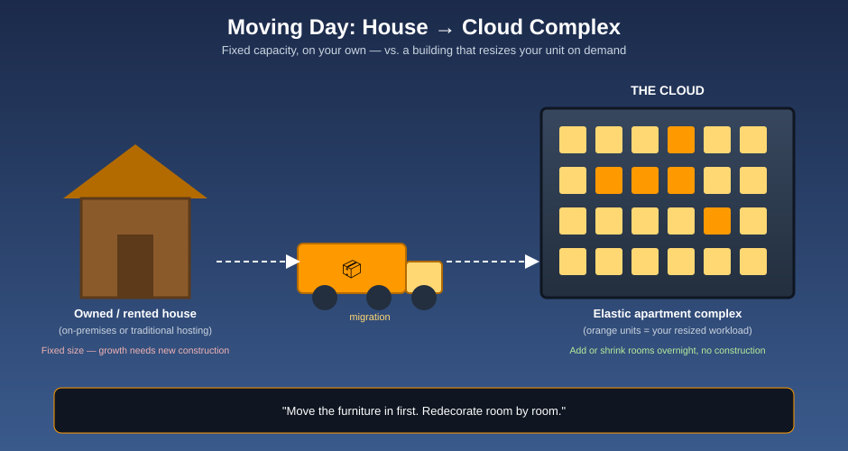
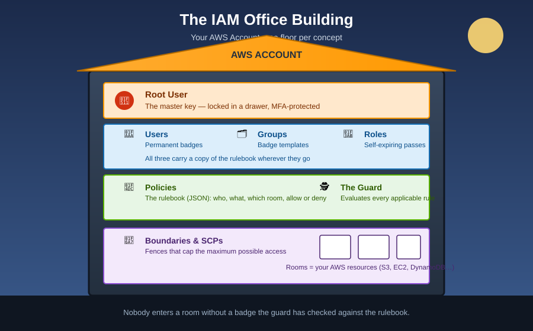
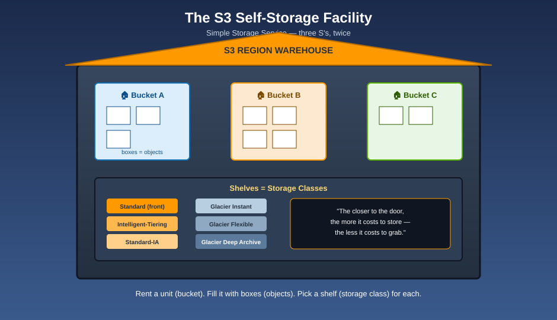
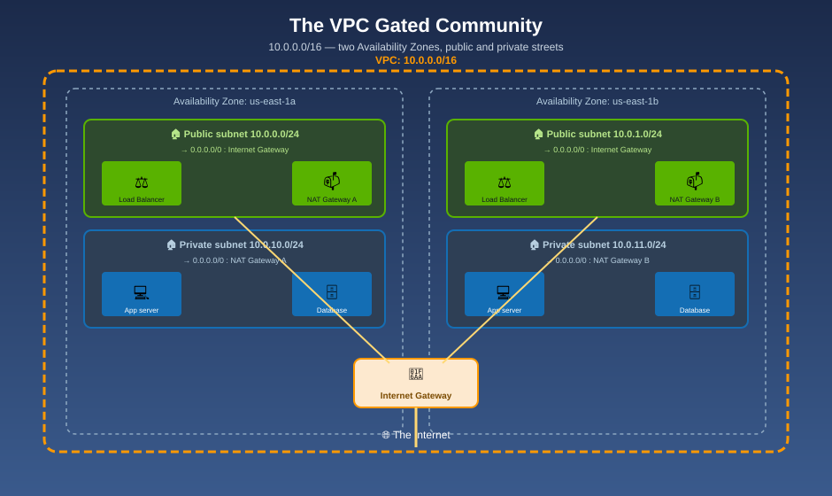

# AWS Knowledge Bundle

**AWS concepts that stick.** An [Open Knowledge Format](https://github.com/GoogleCloudPlatform/knowledge-catalog/blob/main/okf/SPEC.md) (OKF) bundle that explains AWS services through a running visual analogy, hand-built diagrams, and word-for-word mnemonics — so you don't just read the concept once, you remember it for good.

## Why this exists

Most AWS documentation is accurate but forgettable — a wall of text describing a JSON schema. This bundle takes the opposite approach:

- 🧠 **One analogy per service, carried through every doc** — so every new concept slots into a mental model you already have, instead of being one more disconnected fact.
- 🎨 **Original, colorful diagrams for every hard idea** — not screenshots, not AWS's own icon set, but purpose-built visuals that make the analogy literal.
- 🔤 **Explicit, quotable mnemonics** — short sentences and acronyms designed to be the thing you recall first, with the detail hanging off them.
- 🤖 **Machine-readable structure** — every doc follows the [OKF v0.2 spec](https://github.com/GoogleCloudPlatform/knowledge-catalog/blob/main/okf/SPEC.md), so this bundle is just as useful to an AI agent doing research as it is to a human studying for an exam.
- 📚 **Grounded in official AWS docs** — every concept links back to the real [AWS documentation](https://docs.aws.amazon.com/) it's built on.

## 📂 What's inside

### [`cloud-computing/`](cloud-computing/index.md) — Cloud Computing Fundamentals

Taught through **Moving Day**: running things the traditional way is owning (or renting) a fixed house; the cloud is moving into an apartment complex that can resize your unit overnight. Covers why organizations move to the cloud, a short history of AWS as the cloud's reference point, and the IaaS → PaaS → Serverless spectrum.



| | |
|---|---|
| [Why the Cloud, and Why AWS?](cloud-computing/why-cloud-and-aws.md) | [A Brief History of AWS](cloud-computing/history-of-aws.md) |
| [Service Models: IaaS, PaaS & Serverless](cloud-computing/service-models-iaas-paas-serverless.md) | [Moving to Cloud Storage](cloud-computing/moving-to-cloud-storage.md) |
| [Glossary](cloud-computing/glossary.md) | |

**New to the cloud? Start here before any service-specific folder below.**

### [`iam/`](iam/index.md) — AWS Identity and Access Management

Taught through **The Secure Office Building**: your AWS account is a building, the root user is the master key, IAM users are employee badges, roles are self-expiring visitor passes, policies are the rulebook, and a guard checks every rule at every door.



| | | |
|---|---|---|
| [What is IAM?](iam/what-is-iam.md) | [The Root User](iam/root-user.md) | [Users & Groups](iam/users-and-groups.md) |
| [Roles](iam/roles.md) | [Policies](iam/policies.md) | [Policy Evaluation Logic](iam/policy-evaluation-logic.md) |
| [MFA](iam/mfa.md) | [Federation & STS](iam/federation-and-sts.md) | [Permission Boundaries & SCPs](iam/permission-boundaries-and-scps.md) |
| [Best Practices](iam/best-practices.md) | [Mnemonics Cheat Sheet](iam/mnemonics-cheatsheet.md) | [Glossary](iam/glossary.md) |

**The one sentence that unlocks the entire evaluation model:**
> *"Silence means no, a sign saying yes overrides silence, but a sign saying no overrides everything."*

### [`s3/`](s3/index.md) — Amazon S3 (Simple Storage Service)

Taught through **The Self-Storage Facility**: S3 stands for Simple Storage Service — three S's — so think of it as your own Self-Storage Service. Buckets are rented units, objects are boxes on a shelf, and the shelf you pick trades price against how fast you can get the box back.



| | | |
|---|---|---|
| [What is S3?](s3/what-is-s3.md) | [Buckets & Objects](s3/buckets-and-objects.md) | [Storage Classes](s3/storage-classes.md) |
| [Versioning](s3/versioning.md) | [Lifecycle Management](s3/lifecycle-management.md) | [Replication](s3/replication.md) |
| [Security & Access Control](s3/security-and-access-control.md) | [Access Points](s3/access-points.md) | [Encryption](s3/encryption.md) |
| [Sharing & Presigned URLs](s3/sharing-and-presigned-urls.md) | [Static Website Hosting](s3/static-website-hosting.md) | [Performance & Transfer](s3/performance-and-transfer.md) |
| [Consistency Model](s3/consistency-model.md) | [Data Processing & Notifications](s3/data-processing-and-notifications.md) | [Object Lock & Compliance](s3/object-lock-and-compliance.md) |
| [Monitoring & Cost Optimization](s3/monitoring-and-cost-optimization.md) | [Best Practices](s3/best-practices.md) | [Mnemonics Cheat Sheet](s3/mnemonics-cheatsheet.md) |
| [Glossary](s3/glossary.md) | | |

**The one sentence that unlocks storage-class selection:**
> *"The closer to the door, the more it costs to store — and the less it costs to grab."*

### [`device-farm/`](device-farm/index.md) — AWS Device Farm

Taught through **The Real Device Farm**: real physical devices are animals in the barn, a device pool is a herd, an automated test run is a ranch hand walking the whole herd through the same course at once, and Remote Access is you reaching into the pen to walk one animal yourself. A separate stable next door holds tireless robot horses — a managed Selenium Grid — for testing web apps across desktop browsers.


| | | |
|---|---|---|
| [What is Device Farm?](device-farm/what-is-device-farm.md) | [Real Device Testing](device-farm/real-device-testing.md) | [Automated Testing Frameworks](device-farm/automated-testing-frameworks.md) |
| [Remote Access](device-farm/remote-access.md) | [Desktop Browser Testing](device-farm/desktop-browser-testing.md) | [Test Results & Debugging](device-farm/test-results-and-debugging.md) |
| [Private Device Lab](device-farm/private-device-lab.md) | [Integrations & Workflow](device-farm/integrations-and-workflow.md) | [Best Practices](device-farm/best-practices.md) |
| [Mnemonics Cheat Sheet](device-farm/mnemonics-cheatsheet.md) | [Glossary](device-farm/glossary.md) | |

**The one sentence that unlocks real-device testing:**
> *"Real animals beat cardboard cutouts every time."*

### [`global-infrastructure/`](global-infrastructure/index.md) — AWS Global Infrastructure

Taught through **The World Map**: a Region is a city — fully independent, its own everything. An Availability Zone is a borough inside that city, with its own power and water, linked to its siblings by private tunnels. An Edge Location is a corner store near every neighborhood on Earth. Local Zones, Wavelength Zones, and Outposts are satellite outposts built even closer than a Region can reach.


| | | |
|---|---|---|
| [What is Global Infrastructure?](global-infrastructure/what-is-global-infrastructure.md) | [Regions](global-infrastructure/regions.md) | [Availability Zones](global-infrastructure/availability-zones.md) |
| [Edge Locations & CloudFront](global-infrastructure/edge-locations-and-cloudfront.md) | [Local Zones & Wavelength Zones](global-infrastructure/local-zones-and-wavelength-zones.md) | [Designing for High Availability](global-infrastructure/designing-for-high-availability.md) |
| [Best Practices](global-infrastructure/best-practices.md) | [Mnemonics Cheat Sheet](global-infrastructure/mnemonics-cheatsheet.md) | [Glossary](global-infrastructure/glossary.md) |

**The one sentence that unlocks the whole map:**
> *"A Region is a city; an AZ is a borough; a data center is a building."*

### [`vpc/`](vpc/index.md) — Amazon VPC (Virtual Private Cloud)

Taught through **The Gated Community**: a VPC is a private, isolated network you carve out of the cloud. Subnets are streets, each built entirely inside one borough (Availability Zone). Route tables are the street signs. An Internet Gateway is the community's one public front gate — two-way. A NAT Gateway is the mail-forwarding kiosk just inside it — outbound-only, so private streets can send mail out without ever letting a stranger mail them back.



| | | |
|---|---|---|
| [What is a VPC?](vpc/what-is-a-vpc.md) | [Subnets](vpc/subnets.md) | [Route Tables](vpc/route-tables.md) |
| [Internet Gateway](vpc/internet-gateway.md) | [NAT Gateways](vpc/nat-gateways.md) | [Security Groups & NACLs](vpc/security-groups-and-nacls.md) |
| [Tenancy](vpc/tenancy.md) | [VPC Peering & Endpoints](vpc/vpc-peering-and-endpoints.md) | [Connecting to On-Premises](vpc/connecting-to-on-premises.md) |
| [Best Practices](vpc/best-practices.md) | [Mnemonics Cheat Sheet](vpc/mnemonics-cheatsheet.md) | [Glossary](vpc/glossary.md) |

**The one sentence that unlocks NAT Gateways:**
> *"The front gate lets visitors knock. The mail-forwarding kiosk only lets residents send mail out — nobody outside can knock back through it."*

### [`dynamodb/`](dynamodb/index.md) — Amazon DynamoDB

Taught through **The Valet Parking Garage**: a table is the garage, an item is a parked car, and the primary key is the ticket number that tells the valet exactly which section to walk to — instantly, no matter how many thousands of cars are in the garage. Includes a full hands-on tutorial: build a real `CustomerOrders` table, insert schemaless items, and run GetItem, Query, and Scan against it, with both Console steps and AWS CLI commands.


| | | |
|---|---|---|
| [What is DynamoDB?](dynamodb/what-is-dynamodb.md) | [Tables, Items & Attributes](dynamodb/tables-items-and-attributes.md) | [Primary Keys & Partitions](dynamodb/primary-keys-and-partitions.md) |
| [Querying vs. Scanning](dynamodb/querying-vs-scanning.md) | [Secondary Indexes](dynamodb/secondary-indexes.md) | [Capacity Modes](dynamodb/capacity-modes.md) |
| [Streams, TTL & Global Tables](dynamodb/streams-ttl-and-global-tables.md) | [Hands-On Tutorial](dynamodb/hands-on-customer-orders-table.md) | [Best Practices](dynamodb/best-practices.md) |
| [Mnemonics Cheat Sheet](dynamodb/mnemonics-cheatsheet.md) | [Glossary](dynamodb/glossary.md) | |

**The one sentence that unlocks the whole model:**
> *"A relational database lets you ask almost any question, slowly if it must. A valet garage answers one question — instantly — and makes you work harder for anything else."*

More services are on the way — each one gets its own folder, its own analogy, and its own set of diagrams. See [log.md](log.md) for the bundle's history.

## How this bundle is organized

This repository follows the [Open Knowledge Format (OKF) v0.2](https://github.com/GoogleCloudPlatform/knowledge-catalog/blob/main/okf/SPEC.md):

```
├── index.md              # bundle-root index (OKF)
├── log.md                # bundle changelog
├── cloud-computing/      # fundamentals — start here
├── iam/                  # one folder per AWS service/topic
├── s3/                   # ...
├── device-farm/          # ...
├── global-infrastructure/ # ...
├── vpc/                  # ...
└── dynamodb/             # ...
    ├── index.md           # folder index — start here
    ├── log.md             # folder changelog
    ├── *.md               # one concept per file, YAML frontmatter + sources
    └── assets/images/     # original SVG diagrams for that topic
```

Every concept doc cites its official AWS source in a `sources:` frontmatter block and a matching footnote, so you can always jump from the mnemonic straight to the primary documentation.

## Start here

👉 **New to the cloud entirely?** Begin at [`cloud-computing/index.md`](cloud-computing/index.md).
👉 **New to IAM?** Begin at [`iam/index.md`](iam/index.md).
👉 **New to S3?** Begin at [`s3/index.md`](s3/index.md).
👉 **New to Device Farm?** Begin at [`device-farm/index.md`](device-farm/index.md).
👉 **New to Regions/AZs/Edge Locations?** Begin at [`global-infrastructure/index.md`](global-infrastructure/index.md).
👉 **New to VPC/networking?** Begin at [`vpc/index.md`](vpc/index.md).
👉 **New to DynamoDB?** Begin at [`dynamodb/index.md`](dynamodb/index.md).
👉 **Cramming before an exam or interview?** Jump to the [IAM](iam/mnemonics-cheatsheet.md), [S3](s3/mnemonics-cheatsheet.md), [Device Farm](device-farm/mnemonics-cheatsheet.md), [Global Infrastructure](global-infrastructure/mnemonics-cheatsheet.md), [VPC](vpc/mnemonics-cheatsheet.md), or [DynamoDB](dynamodb/mnemonics-cheatsheet.md) Mnemonics Cheat Sheet.
