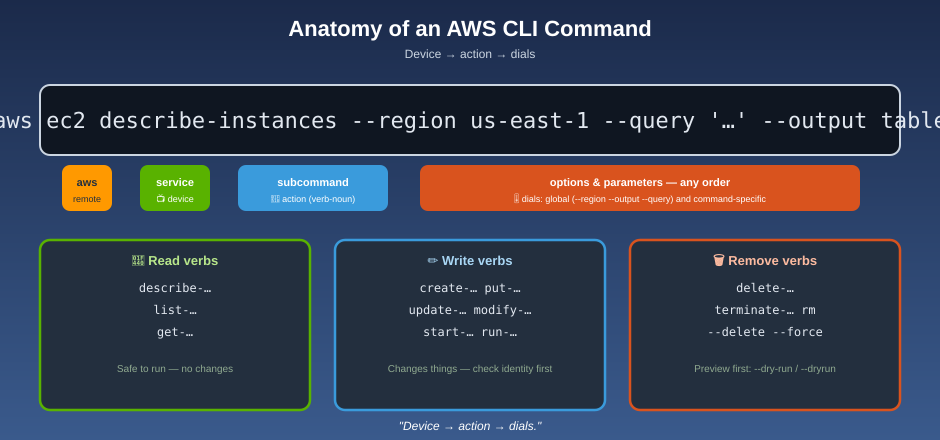

# Command Structure & Getting Help



## 📡 The mnemonic

**Device → action → dials.** Every command is `aws` + *which service* + *what to do* + *the settings*. Learn the sentence once; the vocabulary is the only thing that changes.

```
aws  <service>  <subcommand>  [--option value …]
 │      │            │               │
 │      │            │               └─ dials: parameters & global options
 │      │            └─ the action:  ls, run-instances, describe-table
 │      └─ the device:  s3, ec2, dynamodb, iam, sts …
 └─ the remote itself
```

```bash
aws s3 ls
aws ec2 describe-instances --region us-east-1
aws dynamodb describe-table --table-name CustomerOrders
aws iam create-user --user-name alice
```

Options can come in any order **after** the service and subcommand. If you pass the same single-value option twice, **only the last one counts.**

**Naming pattern worth memorizing:** subcommands are verb-first, kebab-case, and mirror the service API — `describe-`, `list-`, `get-` (read), `create-`, `put-`, `update-`, `modify-` (write), `delete-`, `terminate-` (remove).

## Global options (work on every command)

| Option | Effect |
|---|---|
| `--profile NAME` | Use a named profile |
| `--region REGION` | Override the Region |
| `--output FORMAT` | `json` · `yaml` · `yaml-stream` · `text` · `table` · `off` |
| `--query EXPR` | Filter the result with JMESPath — see [Output & Filtering](output-and-filtering.md) |
| `--debug` | Print every step the CLI takes (the best bug-hunting flag) |
| `--endpoint-url URL` | Send the call to a custom endpoint |
| `--no-paginate`, `--no-cli-pager` | Control paging — see [Pagination](pagination-and-input-files.md) |
| `--cli-auto-prompt` | Turn on interactive suggestions for this command |
| `--no-verify-ssl`, `--ca-bundle` | TLS controls (use `--ca-bundle`, avoid `--no-verify-ssl`) |
| `--no-sign-request` | Call a public endpoint anonymously (e.g., a public S3 bucket) |

## Parameter types

| Type | Example |
|---|---|
| String | `--table-name CustomerOrders` |
| Number | `--max-items 50` |
| Boolean flag | `--recursive`, `--dry-run` / `--no-dry-run` |
| List | `--security-group-ids sg-111 sg-222` |
| Map / shorthand | `--tags Key=Env,Value=dev` |
| JSON | `--block-device-mappings '[{"DeviceName":"/dev/sdb"}]'` |
| Load from a file | `--policy-document file://policy.json` |
| Binary from a file | `--body fileb://image.png` |
| Load from a URL | `--cli-input-json https://…` (HTTP/HTTPS) |

**`file://` vs `fileb://`:** `file://` reads text; `fileb://` reads raw bytes (use it for blobs such as images or zip files). Paths are relative to your current directory.

**Shorthand vs JSON:** `Key=Name,Value=web` is shorthand; `{"Key":"Name","Value":"web"}` is JSON. They're equivalent where both are accepted — shorthand is easier to type, JSON easier to generate.

## Quoting: the #1 source of "invalid JSON" errors

Your **shell** rewrites the command before the CLI ever sees it, so quoting depends on where you're typing.

| Shell | Strings with spaces | JSON values |
|---|---|---|
| **bash / zsh** (Linux, macOS) | `'my key pair'` (single quotes) | Wrap the whole JSON in **single** quotes: `'{"a":"b"}'` |
| **PowerShell** | `'my key pair'` (single quotes, verbatim) | Single quotes work; **safest is to put JSON in a file and use `file://`** |
| **Windows cmd** | `"my key pair"` (double quotes) | Double quotes outside, and escape each inner `"` as `\"` |

```bash
# bash — single quotes around JSON, no escaping needed
aws ec2 run-instances --image-id ami-12345678 \
  --block-device-mappings '[{"DeviceName":"/dev/sdb","Ebs":{"VolumeSize":20}}]'
```

```powershell
# PowerShell — line continuation is a backtick
aws ec2 run-instances `
  --image-id ami-12345678 `
  --block-device-mappings '[{"DeviceName":"/dev/sdb","Ebs":{"VolumeSize":20}}]'
```

```bat
:: cmd — caret continuation, escaped inner quotes
aws ec2 run-instances ^
  --image-id ami-12345678 ^
  --block-device-mappings "[{\"DeviceName\":\"/dev/sdb\",\"Ebs\":{\"VolumeSize\":20}}]"
```

**Escape hatch for any shell:** put the JSON in a file and pass `file://thing.json`. It sidesteps every quoting rule.

**Debug tip:** `echo` the string first to see what your shell actually produces. A value that *starts with a hyphen* needs `=`: `--key-name=-mykey`.

## Getting help — the manual is built into the remote

```bash
aws help                       # all services
aws s3 help                    # one service, and its subcommands
aws s3 cp help                 # one subcommand: synopsis, every option, examples
aws ec2 describe-instances help
```

Each help page has **SYNOPSIS**, **OPTIONS**, **EXAMPLES**, and **OUTPUT** sections. The `EXAMPLES` section is usually the fastest path to a working command. Press `q` to leave the pager.

The online [Command Reference](https://docs.aws.amazon.com/cli/latest/reference/) has the same pages, searchable, and shows what's new in each version.

## `wait` — pause a script until something is ready

Some services expose `wait` subcommands that **block until a condition is true** (or time out). Grammar: `aws <service> wait <condition> [options]`.

```bash
aws ec2 run-instances … --query 'Instances[0].InstanceId' --output text   # → i-0abc…
aws ec2 wait instance-running --instance-ids i-0abc123
echo "instance is up"

aws cloudformation wait stack-create-complete --stack-name my-stack
aws dynamodb wait table-exists --table-name CustomerOrders
```

Without `wait`, scripts race ahead and fail on resources that aren't ready yet. Not every service has waiters — check `aws <service> wait help`.

## Next up

Commands return a lot of data. Learn to shape it: [Output & Filtering](output-and-filtering.md).

[^aws-cli-command-structure]: AWS CLI User Guide for Version 2, "Command structure in the AWS CLI."
[^aws-cli-quoting]: AWS CLI User Guide for Version 2, "Using quotation marks and literals with strings in the AWS CLI."
