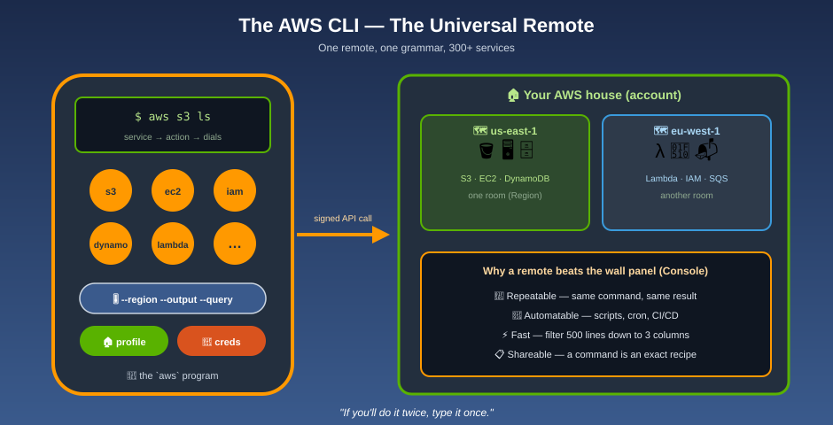

# The AWS CLI — The Universal Remote

**AWS is a house with 300+ devices. The AWS CLI is the one universal remote that controls every one of them — from your keyboard, in a script, or in a CI pipeline.**

The Console is the wall-mounted touch panel: friendly, but you have to walk over and tap. The CLI is the remote in your hand. Every button follows the same grammar — **device → action → settings** — so once you learn it for one service, you already know the shape of all of them. And because a remote can be programmed, anything you can type once you can repeat, schedule, and automate.

| Remote piece | AWS CLI concept |
|---|---|
| 📡 The remote itself | The `aws` program |
| 📺 The device button (TV, speaker, lights) | The **service** — `s3`, `ec2`, `iam`, `dynamodb` … |
| 🔘 The action on that device (power on, volume up) | The **subcommand** — `ls`, `run-instances`, `list-users` … |
| 🎚️ The dials you set before pressing | **Parameters & options** — `--bucket`, `--region`, `--output` |
| 🔑 The pairing code that proves the remote is yours | **Credentials** — access keys, SSO, or a role |
| 🏠 Which house the remote is paired to | A **profile** (account + role + defaults) |
| 🗺️ Which room/city in that house you're controlling | The **Region** |
| 📖 The on-screen channel guide you can filter | **`--query`** (JMESPath) and **`--filters`** |
| 🖼️ How the guide is displayed (list, grid, plain) | **`--output`** — json, yaml, text, table |
| 📄 Flipping through pages of channels | **Pagination** |
| ⭐ Macro buttons ("movie night" = 5 actions) | **Aliases** and shell scripts |
| 🛋️ "Are you sure?" preview before the movie starts | **`--dryrun` / `--dry-run`** |
| 📕 The manual built into the remote | **`aws help`**, `aws <service> help` |

## Read in this order

1. [What is the AWS CLI?](what-is-the-aws-cli.md) — why a remote beats a touch panel, and v1 vs. v2
2. [Installing & Updating](installing-and-updating.md) — Linux, macOS, Windows, verify, update, uninstall
3. [Configuring: Profiles & Settings](configuring-profiles-and-settings.md) — `aws configure`, the config/credentials files, named profiles, env vars, precedence
4. [Authentication: SSO, Roles & Credentials](authentication-sso-and-roles.md) — IAM Identity Center, assume-role, and why long-lived keys are last resort
5. [Command Structure & Getting Help](command-structure-and-help.md) — `aws <service> <action> [options]`, parameter types, quoting, `help`, `wait`
6. [Output & Filtering](output-and-filtering.md) — `--output`, server-side `--filters`, client-side `--query` (JMESPath) with real examples
7. [Pagination & Input Files](pagination-and-input-files.md) — `--max-items`, `--page-size`, pagers, `--generate-cli-skeleton`, `--cli-input-json`
8. [Working with Amazon S3 from the CLI](s3-commands.md) — `aws s3` high-level commands vs. `aws s3api`
9. [Productivity: Auto-Prompt, Completion, Aliases & Scripting](productivity-and-scripting.md) — go faster, script safely
10. [Troubleshooting](troubleshooting.md) — the errors you will hit, and the fix for each
11. [Best Practices](best-practices.md) — how to use the remote without burning the house down
12. [Mnemonics & Command Cheat Sheet](mnemonics-cheatsheet.md) — the one page to keep open in a tab
13. [Glossary](glossary.md) — every term, one line each

**In a hurry?** Read pages 2 → 3 → 4, run `aws sts get-caller-identity`, and you're operational in ten minutes.

## Official AWS references

* [AWS CLI Command Reference (latest)](https://docs.aws.amazon.com/cli/latest/)
* [AWS CLI User Guide for Version 2](https://docs.aws.amazon.com/cli/latest/userguide/cli-chap-welcome.html)
* [Installing or updating the AWS CLI](https://docs.aws.amazon.com/cli/latest/userguide/getting-started-install.html)
* [Configuring settings for the AWS CLI](https://docs.aws.amazon.com/cli/latest/userguide/cli-chap-configure.html)
* [Troubleshooting errors for the AWS CLI](https://docs.aws.amazon.com/cli/latest/userguide/cli-chap-troubleshooting.html)

See [log.md](log.md) for this folder's update history.
