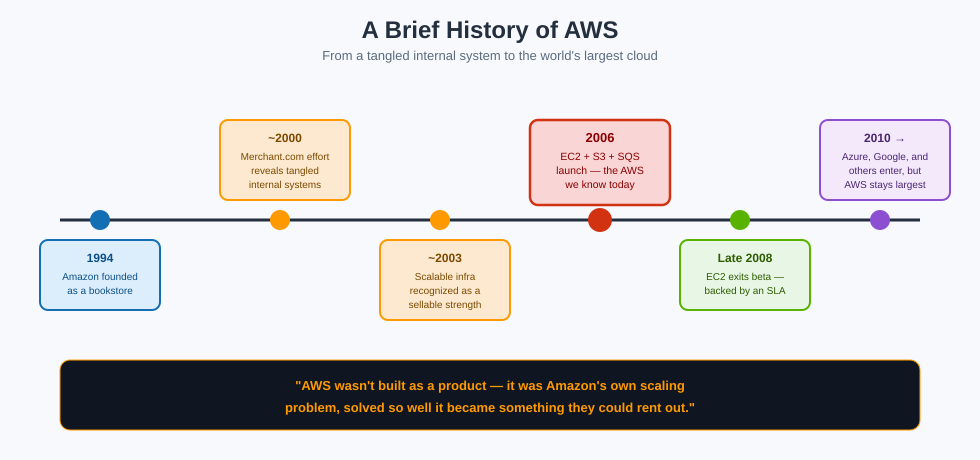

# A Brief History of AWS

## 🏢 The landlord who used to just live here

Every folder in this bundle treats the cloud as an apartment complex you move into (see [Why the Cloud, and Why AWS?](why-cloud-and-aws.md)). Here's the twist: **AWS didn't start out as a landlord.** It started as a tenant with a very specific, very painful problem — and the complex it eventually built for itself became the one it started renting out to everyone else.

**Mnemonic:** *"AWS wasn't built as a product. It was Amazon's own moving day, turned into a business."*

## Stage 1 — Necessity: an online store that couldn't stop growing unevenly

Amazon was founded in 1994 as an online bookseller, and it grew fast — fast enough that its engineering team faced a problem most companies never have to solve at that scale: **demand wasn't just large, it was wildly uneven.** A single sale event or a holiday shopping weekend could multiply traffic overnight, and then demand would fall back down just as quickly. Building for the peak meant paying for idle capacity most of the year; building for the average meant crashing during every big sale.

**Mnemonic:** *"You can't build a warehouse sized for an average day when the busiest day is ten times bigger."* Solving this forced Amazon's engineers to get unusually good, unusually early, at building systems that could flex up and down on demand — years before "elastic" was a term anyone used for computing.

## Stage 2 — Discovery: a side project that exposed the mess

Around 2000, Amazon tried building something called Merchant.com — a platform that would let *other* retailers sell products using Amazon's own technology, the way a landlord might let other tenants move into rooms of the same building. Attempting this surfaced an uncomfortable truth: Amazon's own internal systems, despite running a hugely successful retail business, were tangled together — not the kind of clean, modular building blocks that could be handed to an outside tenant at all.

**Mnemonic:** *"Trying to rent out a room revealed the wiring wasn't separated room by room — it was one tangled circuit for the whole house."*

That discovery kicked off a multi-year internal cleanup: breaking the tangled systems apart into well-defined internal services with clear APIs, each one usable on its own. By around 2003, Amazon's engineers realized something bigger than the cleanup itself: **the ability to build and run massively scalable, flexible infrastructure was, in itself, a core strength** — arguably as valuable as the retail business it was built to support.

## Stage 3 — Product: renting out the apartment complex

That realization turned into a real business only gradually:

| Year | What happened |
|---|---|
| **1994** | Amazon founded, as an online bookstore |
| **~2000** | The Merchant.com effort exposes how tangled Amazon's internal systems are |
| **~2003** | Amazon's engineers recognize scalable infrastructure itself as a sellable strength |
| **2004** | The first, tentative AWS services launch — nothing like the AWS of today |
| **2006** | The AWS most people would recognize is born: **EC2** (virtual servers), **S3** (object storage), and **SQS** (a messaging queue, which had actually existed even earlier) |
| **2006–2007** | EC2 starts limited to Amazon's own existing customers, then opens to public beta |
| **Late 2008** | EC2 exits beta — meaning Amazon is now confident enough to back it with real service-level agreements |
| **~2010 onward** | Other major players enter: Google, then Microsoft with Azure, and later others including IBM and Alibaba |

**Mnemonic:** *"1994 built the house. 2000 found the tangled wiring. 2003 realized the wiring itself was worth selling. 2006 opened the doors to the public."*

## Why EC2, S3, and SQS specifically

The three founding services map neatly onto the three things almost any system needs:

- **EC2 (Elastic Compute Cloud)** — a rentable virtual computer, the compute building block ([see the IaaS discussion](service-models-iaas-paas-serverless.md))
- **S3 (Simple Storage Service)** — durable, rentable storage for files (its own [dedicated folder](../s3/index.md) exists in this bundle for a reason)
- **SQS (Simple Queue Service)** — a way for different parts of a system to hand off work to each other reliably, without waiting on one another directly

**Mnemonic:** *"Somewhere to run your code, somewhere to keep your files, and a mailroom to pass messages between the two — the three ingredients almost every system needs, sold as rentable pieces instead of hardware you own."*

## Why market leadership stuck

AWS had roughly a two-year head start on the next major public cloud (Google) and about a four-year head start on Microsoft Azure. In a business where trust, breadth of services, and operational maturity compound over time, that early lead has proven durable: AWS has remained the largest cloud provider by revenue every year since, generally running well ahead of the second-place provider, which in turn runs ahead of the third. Exact percentages shift from quarter to quarter and depend on exactly what's being measured (infrastructure services alone vs. the broader cloud market), but the **ranking order** has stayed remarkably stable for well over a decade.

**Mnemonic:** *"First mover, biggest mover, still the mover — the two-to-four-year head start became a lead nobody has fully closed."*

## Why this history matters beyond trivia

This isn't just a fun fact — it explains **why AWS is organized the way it is**. AWS's services still largely reflect the internal building blocks Amazon originally built to run its own retail business: compute, storage, messaging, and (eventually) the identity and access layer needed to let separate teams and separate companies use those building blocks safely without stepping on each other. Understanding that origin makes the *shape* of AWS's service catalog feel a lot less arbitrary.

## Next up

See how those building blocks come together in a real migration: [Service Models: IaaS, PaaS & Serverless](service-models-iaas-paas-serverless.md).
