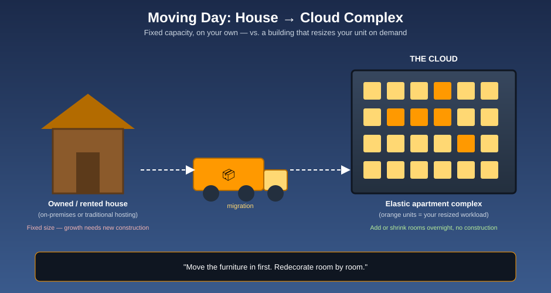

# Cloud Computing Fundamentals — Moving Day

Before you learn any single AWS service, it helps to understand **why the cloud exists at all** and **what you're actually renting** when you use it. This folder covers the fundamentals that every service-specific folder (like [`iam/`](../iam/index.md) and [`s3/`](../s3/index.md)) quietly assumes you already know.

## 🚚 The mnemonic: Moving Day

Running a website or application the traditional way is like **owning a house** — or renting a fixed one from a small, one-building landlord. Everything about it (space, wiring, upkeep) is fixed the day you move in, and growing means a whole new construction project.

**The cloud is a moving day into an endlessly-expandable global apartment complex.** The complex can add rooms overnight, hand you a bigger or smaller unit whenever your needs change, and it's already wired for water, power, and security — you just decide how much of the "furnishing" you want to do yourself.

| Housing concept | Cloud computing concept |
|---|---|
| 🏠 A house you built and maintain yourself | On-premises infrastructure |
| 🏚️ A fixed house rented from a small landlord | Traditional (non-cloud) hosting |
| 🏢 An endlessly-expandable apartment complex | The cloud (AWS, Azure, GCP, …) |
| 📦 Moving your household into a new unit | Migrating a workload to the cloud |
| 🔧 Furnishing the unit yourself vs. renting it furnished | Infrastructure as a Service vs. Platform as a Service |
| 🕐 Renting a meeting room only when you need it | Serverless computing |

## Read in this order

1. [Why the Cloud, and Why AWS?](why-cloud-and-aws.md) — the case for moving, and why AWS is the reference point worth learning first
2. [Service Models: IaaS, PaaS & Serverless](service-models-iaas-paas-serverless.md) — how much of the "apartment" you furnish yourself, and the migration path most companies actually take
3. [Glossary](glossary.md) — every term, one line each

## Where this fits in the bundle

This folder is the **on-ramp**. Once the ideas here feel natural, the service-specific folders go much faster:

* [`iam/`](../iam/index.md) — who gets a key to which room
* [`s3/`](../s3/index.md) — where the boxes actually get stored

More cloud-computing fundamentals will be added here over time — see [log.md](log.md) for this folder's history.
