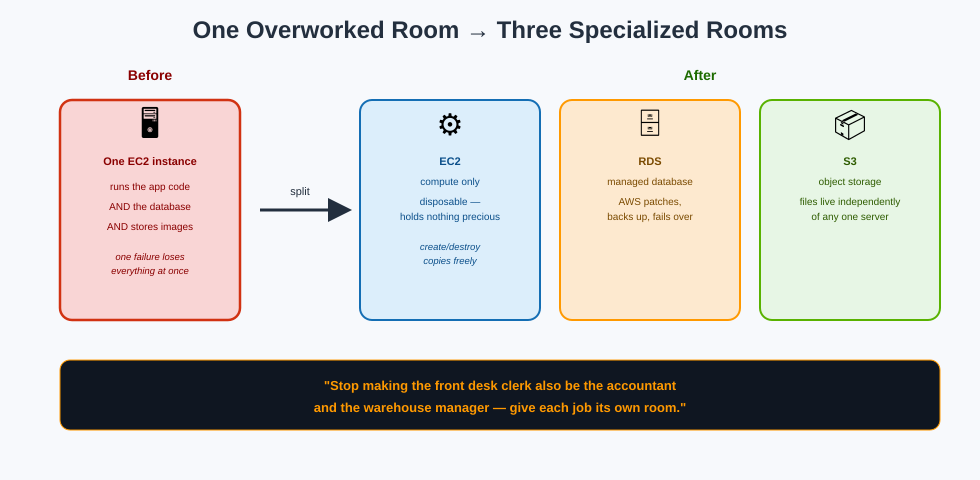
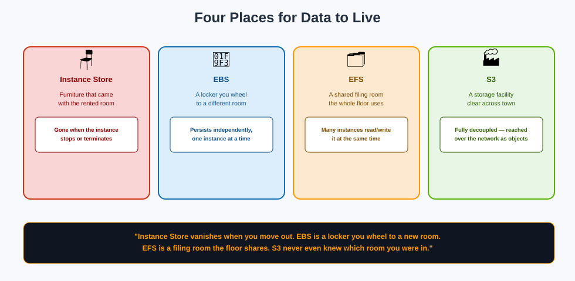

# Moving to Cloud Storage

## Where the story left off

[Service Models: IaaS, PaaS & Serverless](service-models-iaas-paas-serverless.md) ended with a simple first move: take a website running on one physical or rented machine, and re-create it as one virtual machine in the cloud. Nothing about the *design* changed yet — just the building it lives in. This doc picks up right after that first move, when growth starts exposing why "one machine doing everything" doesn't stay a good idea for long.

## One room, doing three jobs badly

Picture a small online store that began on a single server — maybe literally a machine sitting in a spare room. That one server does *everything*: it serves web pages, it runs the logic that decides what to show a shopper, it holds the database of orders and prices, and it stores the product photos. It works, right up until the business starts growing.

Growth turns that single room into a mess of competing chores:

- **Maintenance never stops** — patching, backing up, watching for failures, all falling on whoever owns that one box.
- **One failure takes down everything** — the web pages, the database, and the stored files all disappear together, because they all live in the same place.
- **Scaling anything means scaling everything** — even if only the web traffic is spiking, you can't grow just that part without dragging the database and file storage along with it.

**Mnemonic:** *"One overworked room, doing three jobs at once, badly — the moment you outgrow it, everything jams up together."*

## The first move: same job, someone else's building

The first fix from [Service Models](service-models-iaas-paas-serverless.md) is a straightforward one: replace that single physical machine with a single virtual one — an EC2 instance. It behaves like the same computer, just now living in AWS's data center instead of a spare room. The moment this happens, two things quietly get much easier: you stop being responsible for the physical hardware entirely, and — because it's virtual — resizing it (more CPU, more memory) becomes a matter of minutes instead of a shopping trip.

That alone is a real win. But the server is still doing three jobs in one room. The next move is to stop doing that.

## The real move: giving each job its own room

The insight that unlocks real scalability is noticing that a single server is actually bundling together two very different kinds of work:

1. **Computing** — running the application's code, deciding what to show a shopper, handling web requests
2. **Storing** — holding data that needs to persist: a database of orders and prices, and files like product images

Once you see it that way, the fix is to give each job **its own dedicated room**:

| Job | Dedicated AWS service | What changes |
|---|---|---|
| Running application code | **EC2** (compute only, nothing else) | Can be freely destroyed and recreated — it holds nothing irreplaceable |
| Managing the database | **RDS** (a managed database service) | AWS handles patching, backups, and failover; you just use it |
| Storing files like images | **S3** (object storage) | Files live independently of any one server, reachable from anywhere |

**Mnemonic:** *"Stop making the front desk clerk also be the accountant and the warehouse manager — give each job its own room, and each room can grow on its own schedule."*

## Why this unlocks real scalability

Once compute, database, and file storage are separated, something powerful becomes possible: **EC2 instances become disposable.** Because an EC2 instance no longer holds any unique data of its own — the database lives in RDS, the files live in S3 — you can create a second, third, or hundredth copy of it at will, all pointing at the *same* database and the *same* file storage. Traffic spikes (a big sale, a holiday rush) get handled by adding more disposable compute instances, without touching the data layer at all.

**Mnemonic:** *"A disposable room can be knocked down and rebuilt overnight, because nothing valuable was ever kept in it — the valuables live down the hall, in the vault and the filing room."*

## The four places data can actually live

"Storage" in AWS isn't one thing — it's at least four meaningfully different options, and knowing which is which matters:

| Storage type | What it's like | Key trait |
|---|---|---|
| **Instance Store** | Furniture that came with a rented room | Disappears the moment the instance is stopped or terminated — nothing else can see it |
| **EBS (Elastic Block Store)** | A personal storage locker you can wheel out and attach to a different room | Persists independently of any one instance, but typically attached to only one at a time |
| **EFS (Elastic File System)** | A shared filing room on the same floor that several rooms can open at once | Multiple instances can read/write it concurrently — a real shared filesystem |
| **S3** | A separate self-storage facility across town | Fully decoupled from any instance; reached over the network as objects, not a mounted disk — see the full [S3 folder](../s3/index.md) for everything this includes |

**Mnemonic:** *"Instance Store is furniture that vanishes when you move out. EBS is a locker you can wheel to a new room. EFS is a filing room the whole floor shares. S3 is the storage facility clear across town that never even knew which room you were in."*

None of these are mutually exclusive — a real system typically uses several at once: instance store for temporary scratch space, EBS for a database's own disk, and S3 for everything that doesn't need to sit on a server at all.

## Next up

For the full picture of what that self-storage facility across town can actually do, see the dedicated [S3 folder](../s3/index.md), starting with [What is S3?](../s3/what-is-s3.md).
