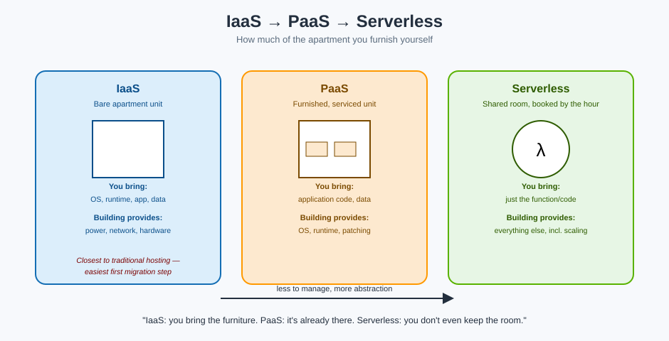

# Service Models — How Much of the Apartment You Furnish



## A concrete moving story

Picture an online store currently running on a single computer — either a physical machine sitting in a back room at the company's office, or a rented dedicated server at a traditional hosting company. It works, but it's stuck at a fixed size, and growing it means buying or renting *another* fixed-size machine.

The move into the cloud usually isn't "redesign everything overnight." It's a **step-by-step migration**:

1. **Move first, improve later.** Re-create the same computer as a virtual one in the cloud, so the website runs exactly as it did before — just inside the apartment complex instead of a house.
2. **Configure it properly** once it's in the cloud — networking, security, storage.
3. **Improve iteratively**, introducing more cloud building blocks over time as the business's needs grow, instead of trying to adopt everything on day one.

**Mnemonic:** *"Move the furniture in first. Redecorate room by room."* Trying to redesign an entire architecture in one leap is how migrations stall — moving the existing setup in as-is, then improving it, is how they actually finish.

## The three service models, as apartment arrangements

| Model | Apartment analogy | What AWS manages | What you manage |
|---|---|---|---|
| **IaaS** (Infrastructure as a Service) | A bare unit: power, water, and security are handled by the building; you bring every piece of furniture | Physical hardware, networking, virtualization | Operating system, runtime, application, data |
| **PaaS** (Platform as a Service) | A furnished, serviced unit: furniture and cleaning included; you just move your belongings in | Hardware, OS, runtime, patching | Your application code and data |
| **Serverless** | Booking a shared meeting room by the hour: you don't hold a unit at all, you just show up when needed | Nearly everything, including scaling capacity up and down | Just the code that runs when triggered |

**Mnemonic:** *"IaaS: you bring the furniture. PaaS: the furniture's already there. Serverless: you don't even keep a room — you just book time in one."*

## Why the learning path usually starts with IaaS

Of the three, **IaaS is the smallest conceptual jump** from traditional hosting. A "virtual computer in the cloud" behaves almost exactly like the physical or rented computer it's replacing — same operating system concepts, same idea of installing and running software — just now living in a building that can resize or duplicate that unit on demand instead of requiring a new physical purchase.

That's why a first migration commonly targets IaaS: it gets the workload off fixed, hard-to-scale hardware and into an elastic environment **without** also requiring the team to rethink how the application itself is built. PaaS and serverless are genuinely more efficient for many workloads, but they ask more of you upfront — redesigning the application to fit a more managed, more opinionated model. They're a *next* step, not a prerequisite first one.

## The pattern to remember

```
Traditional hosting (fixed house)
        │  move as-is
        ▼
IaaS — a virtual computer in the cloud (bare apartment unit)
        │  improve iteratively: add storage, identity, scaling, managed databases...
        ▼
PaaS / Serverless — as the team is ready to trade control for less operational overhead
```

Growth in the cloud isn't a single decision — it's a direction. Most real systems live somewhere on this spectrum, often mixing models: a core application on IaaS, a few background jobs running serverless, and a managed database in between.

## Next up

Check unfamiliar terms in the [Glossary](glossary.md), or head into a specific AWS service: [IAM](../iam/index.md) for identity and access, or [S3](../s3/index.md) for storage.
