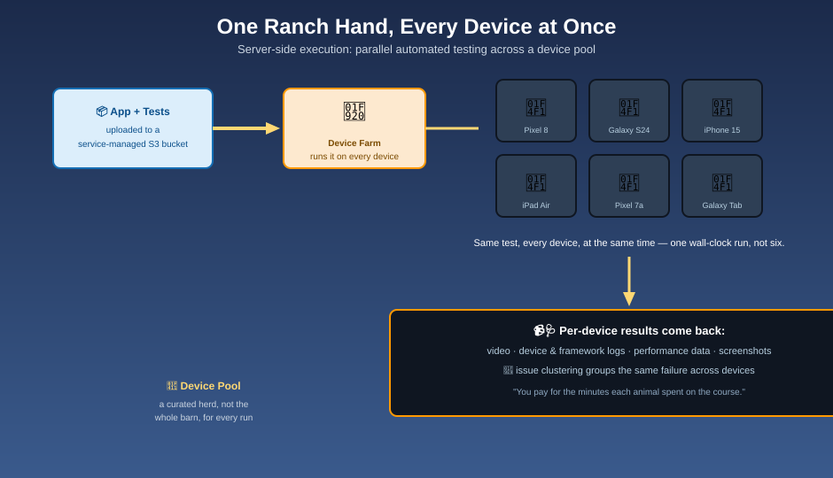

# Automated Testing Frameworks — The Ranch Hand

## 🤠 The mnemonic

One ranch hand can run a thousand animals through the same obstacle course simultaneously. That's automated testing on Device Farm: upload your app once, pick a device pool, and the identical test runs **in parallel** across every device in that pool — your whole suite finishes in roughly the time a *single* device would take, not the sum of all of them.

## No scripting required: the built-in test type

If you don't have test scripts yet, Device Farm can still exercise your app out of the box. There is exactly **one** built-in test type:

| Built-in type | Platform | What it does |
|---|---|---|
| **Fuzz** | Android & iOS | Sends pseudo-random streams of touch events at the app, looking for crashes |

**Mnemonic:** *"Let the ranch hand wander the field before you teach it a specific route."* Run Fuzz first on any new build as a zero-effort smoke test, before investing in scripted coverage. (An earlier, script-free "Explorer" crawler existed for Android in the past — current Device Farm ships Fuzz as its one built-in type, on both platforms.)

## Scripted frameworks Device Farm supports

Already have a test suite? Device Farm runs it as-is, across the frameworks it supports per platform:

| Platform | Supported frameworks |
|---|---|
| **Android** | Automatic Appium tests · Instrumentation (Espresso and UI Automator tests both run under the Instrumentation framework) |
| **iOS** | Automatic Appium tests · XCTest · XCTest UI |
| **Web applications** | Appium |

Appium tests can be written in Java (JUnit/TestNG), Python, Node.js, or Ruby. In a custom test environment, Device Farm supports **Appium version 1**; it does not offer a customizable test environment for the XCTest framework.

**Mnemonic:** *"Bring your own leash — Device Farm doesn't care which client wrote the script, only that it speaks Appium, Instrumentation, or XCTest."*

## How a run actually executes: server-side execution

1. Inside a **Project**, you upload your app build and your test package — Device Farm stores both in a secure, **service-managed Amazon S3 bucket**.
2. You choose a device pool (see [Real Device Testing](real-device-testing.md)) and a run configuration — network profile, location, extra data.
3. Device Farm spins up the underlying infrastructure itself, including [service-managed test hosts](https://docs.aws.amazon.com/devicefarm/latest/developerguide/custom-test-environments-hosts.html) physically close to each device, and installs your app on every device in the pool.
4. The identical test suite runs on every device **in parallel** — this is what AWS calls **server-side execution**: fast, and you never manage the test-host infrastructure yourself. It scales well both for independent testing across many devices and for running from inside a CI/CD pipeline.
5. Results, videos, and logs come back per-device into another service-managed S3 bucket (see [Test Results & Debugging](test-results-and-debugging.md)).

**Mnemonic:** *"The farm keeps its own barn records — your app and results both live in an S3 bucket Device Farm manages for you."*

Appium testers who'd rather drive tests from their own machine instead of the managed pipeline aren't stuck with server-side execution — a [Remote Access](remote-access.md) session also exposes a **client-side** Appium endpoint against a real device.

## Why parallel matters

Running a 200-test suite on one device serially might take hours. Running it across a 20-device pool in parallel can bring that down to a fraction of the time — you pay for total device-minutes consumed, not wall-clock time waited.

**Mnemonic:** *"You don't pay for the whole herd to stand around — you pay for the minutes each animal actually spent on the course."*

## Next up

Sometimes you need to feel the leash yourself, not delegate to the ranch hand: [Remote Access](remote-access.md).

[^aws-device-farm-frameworks]: AWS Device Farm Developer Guide, "Test types."
