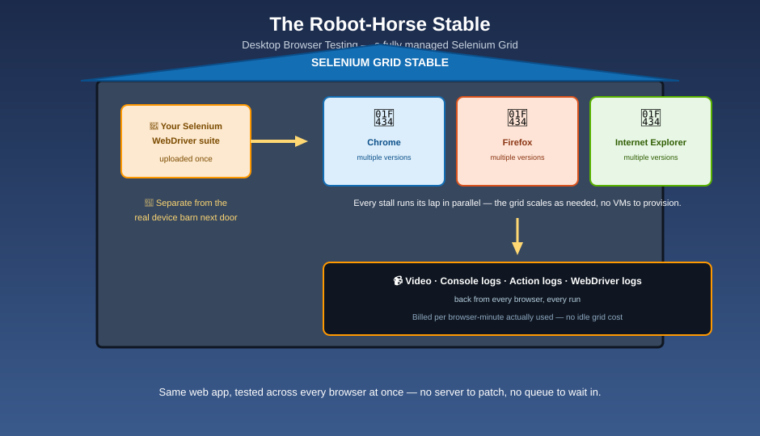

# Desktop Browser Testing — The Robot-Horse Stable

## 🐴 The mnemonic

Next door to the barn full of real animals, there's a separate stable of tireless robot horses that run laps all day without getting tired. That's Device Farm's desktop browser testing: a fully managed **Selenium Grid**, hosted in the AWS Cloud, running your existing Selenium WebDriver tests across multiple browsers and versions in parallel — no grid to provision, patch, or scale yourself.

## What's actually being tested here

This is a distinct offering from the real-device side of Device Farm covered in the rest of this folder — it's aimed at **web apps**, not native mobile apps, and the thing under test is your app running inside a **desktop browser**, not a phone.

| | Real Device Testing | Desktop Browser Testing |
|---|---|---|
| What's tested | Native/hybrid mobile apps | Web apps, via a desktop browser |
| What it runs on | Real physical phones/tablets | A managed Selenium Grid |
| Browsers/devices covered | Real Android & iOS device fleet | Chrome, Firefox, Internet Explorer — multiple versions |
| Test framework | Appium, Instrumentation, XCTest, Fuzz | Selenium WebDriver |

## Why run it here instead of your own grid

- **Concurrency without capacity planning.** The grid scales as needed so your whole cross-browser suite runs in parallel, instead of queueing behind a fixed number of self-hosted browser VMs.
- **Pay-as-you-go.** You pay for the total minutes your tests actually execute — no idle grid sitting around between runs, and no extra cost penalty for running more tests concurrently.
- **Debugging artifacts included.** Every run comes back with a recorded video, browser console logs, action logs, and WebDriver logs — the same "vet's checkup report" philosophy as the mobile side (see [Test Results & Debugging](test-results-and-debugging.md)).

**Mnemonic:** *"The robot horses never get tired of running the same lap — spin up ten, spin up a hundred, you only pay for the minutes they actually galloped."*

## What you'll use it for

- Running an existing Selenium regression suite against Chrome, Firefox, and IE before every release
- Catching browser-specific rendering or JavaScript bugs that only show up in one engine
- Gating a CI/CD pipeline on cross-browser compatibility, the same way mobile automated tests gate it on device compatibility

## Next up

Both sides of the farm — real devices and the browser stable — produce the same kind of evidence when something goes wrong: [Test Results & Debugging](test-results-and-debugging.md).

[^aws-device-farm-browser]: AWS Device Farm, "Testing on desktop browsers," aws.amazon.com/device-farm.
