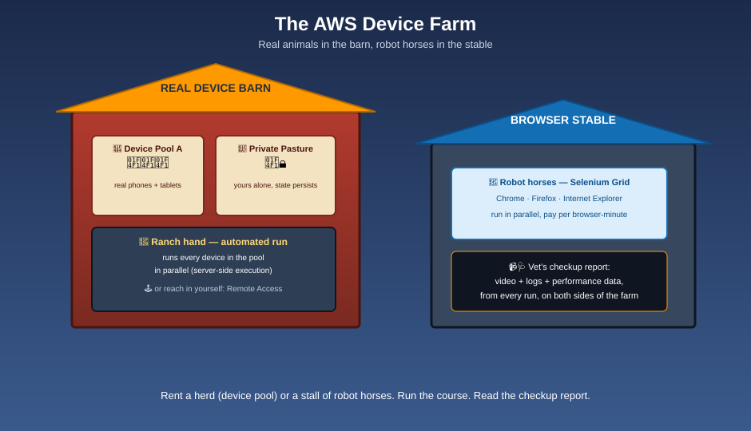

# AWS Device Farm — The Real Device Farm

**Device Farm rents you a barn full of real, physical devices — not cardboard cutouts (emulators) — so you can find out how your app actually behaves in the real world.**

You pick a **herd** (device pool) of real phones and tablets, send a **ranch hand** (an automated test) to run every animal through the same obstacle course at once, or reach into the pen yourself and walk one animal on a leash (Remote Access). Next door there's a separate stable of tireless robot horses (a managed Selenium Grid) for testing your web app across desktop browsers. Every run comes back with a vet's checkup report — videos, logs, and performance data — so you can fix what's actually broken.

| Farm piece | Device Farm concept |
|---|---|
| 🌾 The farm itself | Amazon/AWS Device Farm, the service |
| 📋 The front gate you check in at | A **Project** — the container holding your app uploads and run/session history |
| 🐄 An animal in the barn | A real physical device — specific model, OS version, and carrier |
| 🐑 A herd of similar animals | A **Device Pool** — a curated group of devices to test against |
| 🤠 A ranch hand running the whole herd through an obstacle course at once | An **automated test run**, executed in parallel across every device in the pool |
| 🕹️ Reaching into the pen and walking one animal yourself | **Remote Access** — real-time manual interaction from your browser |
| 🌦️ The weather machine mounted over the pen | Simulated network conditions, GPS location, language, and preloaded data/apps |
| 📹🩺 The vet's checkup report | Videos, device logs, and performance data captured from every run |
| 🧩 The farmhand who notices five sick animals share one symptom | Automatic **issue clustering** across failed devices |
| 🚧 A fenced-off private pasture, yours alone | The **Private Device Lab** — reserved, exclusive devices with persisted state |
| 🐴 The separate stable of tireless robot horses | **Desktop Browser Testing** — a managed Selenium Grid (Chrome, Firefox, Internet Explorer) |
| 📡 The control room wired into your tractor's dashboard | **Integrations** — Android Studio, Jenkins, the CLI/API, CI/CD pipelines |

## Read in this order

1. [What is Device Farm?](what-is-device-farm.md) — the barn, the pun, and why real beats fake
2. [Real Device Testing](real-device-testing.md) — the herd, device pools, and simulating real-world conditions
3. [Automated Testing Frameworks](automated-testing-frameworks.md) — built-in Fuzz, Appium, Instrumentation, XCTest, and parallel server-side runs
4. [Remote Access](remote-access.md) — walking one animal yourself, in real time
5. [Desktop Browser Testing](desktop-browser-testing.md) — the robot-horse stable: Selenium at scale
6. [Test Results & Debugging](test-results-and-debugging.md) — videos, logs, performance data, and issue clustering
7. [Private Device Lab](private-device-lab.md) — your own fenced-off pasture
8. [Integrations & Workflow](integrations-and-workflow.md) — IDEs, CI/CD, the API, and how a run actually flows
9. [Best Practices](best-practices.md) — how a well-run farm operates
10. [Mnemonics Cheat Sheet](mnemonics-cheatsheet.md) — the one page to review before an exam or interview
11. [Glossary](glossary.md) — every term, one line each

## Official AWS references

* [AWS Device Farm product page](https://aws.amazon.com/device-farm/)
* [AWS Device Farm Developer Guide](https://docs.aws.amazon.com/devicefarm/latest/developerguide/welcome.html)
* [AWS Device Farm — Supported frameworks](https://docs.aws.amazon.com/devicefarm/latest/developerguide/test-types.html)

See [log.md](log.md) for this folder's update history.
