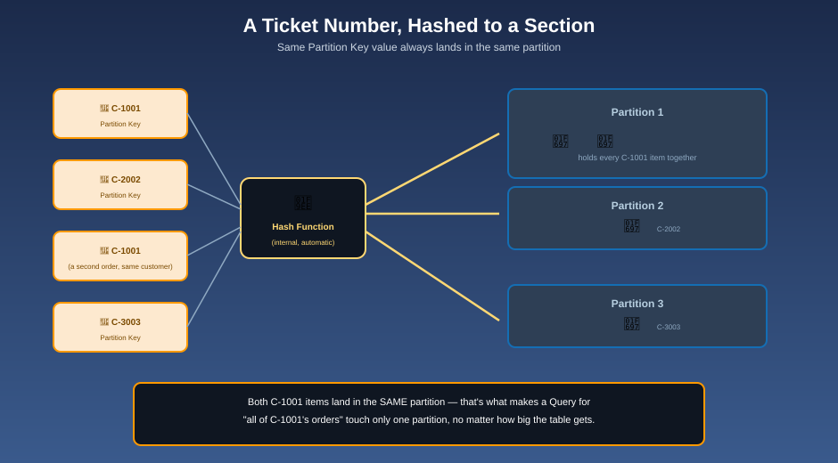

# Primary Keys & Partitions — Your Ticket Number, and Where It Sends You

## 🎫 The mnemonic

Your ticket number isn't just a label — the garage runs it through a formula the moment you hand it over, and that formula spits out **exactly which section of the garage** your car is parked in. Every ticket with the same number always maps to the same section; that's what makes the lookup instant instead of a search.

## Two kinds of primary key

| Key type | Structure | What it guarantees |
|---|---|---|
| **Simple primary key** | Partition Key alone | Every item's Partition Key value must be **unique** in the table |
| **Composite primary key** | Partition Key + Sort Key | The **combination** must be unique; the *same* Partition Key can repeat across many items, each with a different Sort Key |

**Mnemonic:** *"A simple key is one ticket number, and only one car may ever hold it. A composite key is a ticket number plus a spot letter — many cars can share a ticket number, as long as each sits in a different lettered spot."*

A composite key is what makes the classic "all of one customer's orders" pattern work: Partition Key = `CustomerId`, Sort Key = `OrderId` — every order for the same customer shares a Partition Key, but each has its own Sort Key, and DynamoDB keeps every item for one Partition Key physically grouped together, in Sort Key order.

## Partitioning: the hashing, made concrete

DynamoDB runs your **Partition Key value** through an internal hash function to decide which physical partition stores the item. Two consequences follow directly from this:

1. **Same Partition Key → same partition, every time.** This is exactly why a Query against one Partition Key is fast — DynamoDB doesn't search, it computes the hash and goes straight there.
2. **Different Partition Key values are meant to spread evenly across partitions.** The hash function does this automatically — your job is to *choose* a Partition Key whose values are naturally varied and high-cardinality.

**Mnemonic:** *"The hash formula doesn't care what your ticket number means to you — it only cares that different numbers land in different sections, evenly."*

## The hot partition problem

If too many requests target the **same** Partition Key value, all of that traffic lands on one physical partition — which has its own throughput ceiling. This is a **hot partition**, and it's the single most common real-world DynamoDB performance problem.

**Mnemonic:** *"If every customer's ticket says 'VIP' instead of their own account number, every single car funnels into one section of the garage — and that section grinds to a halt, no matter how big the rest of the garage is."*

**Typical fixes:**

- Choose a Partition Key with naturally high cardinality (a customer ID, not a status flag like `"ACTIVE"`)
- Add a random or calculated **suffix** to an otherwise low-cardinality key, to spread writes artificially (a "write sharding" pattern)
- Reconsider whether the access pattern driving the hot key even belongs on this table

## Why key design comes before everything else

Unlike a relational database, you can't easily bolt on a new way to query DynamoDB data after the fact — an inefficient key design usually means falling back to a slow [Scan](querying-vs-scanning.md), or redesigning (and migrating) the table. **Decide your access patterns first, and let the key design follow from them** — not the other way around.

**Mnemonic:** *"Design the ticket system before you open the garage — retrofitting it after a thousand cars are already parked is a much bigger job."*

## Next up

See exactly what a well-chosen key buys you at read time: [Querying vs. Scanning](querying-vs-scanning.md).

[^aws-ddb-partition-key]: Amazon DynamoDB Developer Guide, "Core components — Primary key."
