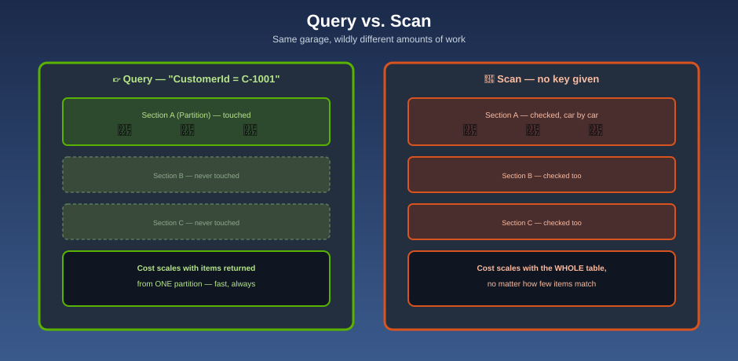

# Querying vs. Scanning — The Ticket vs. Walking Every Row

## 👉 GetItem — one ticket, one car

**GetItem** is the simplest possible request: hand over the exact Partition Key (and Sort Key, if the table has one), and get back exactly one item. No searching, no ambiguity.

## 🔎 Query — one ticket number, every matching spot

**Query** hands over a Partition Key and asks for **every item that shares it** — optionally narrowed further by a condition on the Sort Key (`"orders after 2026-01-01"`, `"orders starting with ORD-2026"`). Because every item for a given Partition Key lives physically together, a Query only ever touches the one partition it needs — it's fast regardless of how large the *table* is, because it never looks at the other partitions at all.

**Mnemonic:** *"Hand over ticket C-1001, and the valet walks straight to that one section and brings back every car in it — sorted by spot number — without ever glancing at any other section of the garage."*

## 🔦 Scan — no ticket, check every car

A **Scan** reads **every item in the entire table**, then (optionally) filters out the ones that don't match what you're looking for. It always costs capacity proportional to the table's full size, no matter how few items actually match your filter — because DynamoDB still has to read every item before it can discard the ones that don't qualify.

**Mnemonic:** *"A Scan is walking every row of the garage, checking every single car's tag by hand, and only then deciding which ones you actually wanted."*

## Side by side

| | GetItem | Query | Scan |
|---|---|---|---|
| What you provide | Exact Partition Key (+ Sort Key) | Partition Key (+ optional Sort Key condition) | Nothing required — reads everything |
| Items touched | Exactly 1 | Only the matching partition | The **entire table** |
| Cost scales with | 1 item | Items returned from that partition | The size of the **whole table** |
| Typical use | Fetch one known record | "All of X's orders," "X's orders after date Y" | Rare — a full export, an ad hoc admin query, a one-off migration |

**Mnemonic:** *"GetItem: one ticket, one car. Query: one ticket, one section. Scan: no ticket, the whole garage — every time."*

## The consistency choice underneath every read

Every Query, GetItem, and Scan lets you choose between two consistency levels:

| | Eventually Consistent (default) | Strongly Consistent |
|---|---|---|
| Guarantee | May briefly reflect data from just before the most recent write | Always reflects every write that completed before the read started |
| Cost | Cheaper — roughly half the capacity of a strongly consistent read | More expensive |
| Availability | Can be served by any replica | Requires reaching a replica that's certain to be current |

**Mnemonic:** *"Eventually consistent: the valet at the nearest booth, who might be a few seconds behind on the newest arrivals. Strongly consistent: insisting on the one valet who's absolutely certain the newest car is already logged — worth the extra wait only when you actually need it."*

Default to eventually consistent reads unless a specific workflow genuinely can't tolerate a few-hundred-millisecond staleness window (for example, reading back a value you just wrote, in the same request flow, where correctness depends on seeing your own write immediately).

## Next up

Query is fast *only* along the path your primary key already supports. For every other way you need to look items up, see [Secondary Indexes](secondary-indexes.md).

[^aws-ddb-query]: Amazon DynamoDB Developer Guide, "Query."
[^aws-ddb-scan]: Amazon DynamoDB Developer Guide, "Scan."
