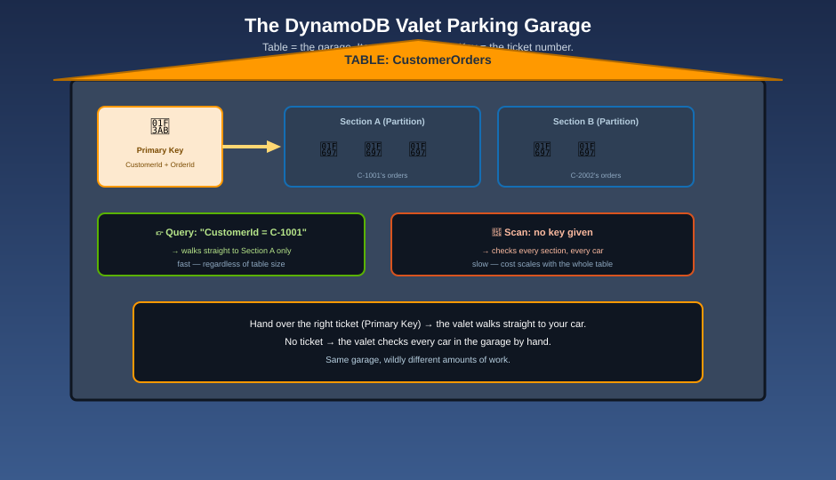

# What is Amazon DynamoDB?

**Amazon DynamoDB** is a fully managed, serverless **NoSQL** database built around one core promise: if you know an item's key, DynamoDB retrieves it in single-digit-millisecond time — whether the table holds a thousand items or a trillion. There's no server to provision, no OS to patch, and (in its default capacity mode) no capacity to plan ahead of time.

## 🎫 The mnemonic: a valet parking garage

Picture DynamoDB as a **valet parking garage**. You don't wander the lot looking for your car — you hand the valet your **ticket number**, and they walk straight to the exact spot your car is parked, no matter how many thousands of other cars are in the garage. That ticket number is your **primary key**, and the "walk straight there" behavior is the entire reason DynamoDB exists: it trades the flexibility of "search by anything" for the guarantee of "instant, no-search retrieval by key."

## NoSQL, and what that actually means here

DynamoDB is a **key-value and document** database, not a relational one. The practical differences:

| | Relational (e.g. RDS/MySQL) | DynamoDB |
|---|---|---|
| Schema | Fixed columns, enforced for every row | Only the **primary key** is fixed — every item can otherwise have different attributes |
| Relationships | Joins across tables | No joins — you design the table so the data you need together is stored together |
| Scaling | Usually vertical, with effort | Horizontal and automatic — partitions split as data grows |
| Query flexibility | Any column, any condition, via SQL | Fast only through the key (and indexes you define) — everything else is a slow Scan |

**Mnemonic:** *"A relational database lets you ask almost any question, slowly if it must. A valet garage answers one question — 'where's the car with this ticket?' — instantly, and makes you work harder for anything else."*

## Fully managed and serverless

There is no DynamoDB "instance" to size or patch — you create a **table**, and AWS handles the servers, storage, replication (data is automatically replicated across multiple Availability Zones within a Region for durability), and scaling behind the scenes. This is a deliberate contrast with something like Amazon RDS, where you still choose and manage an underlying instance size.

## What you'll actually use it for

DynamoDB is the default choice when an application needs:

- **Predictable, low-latency access by a known key** — a user profile by user ID, a shopping cart by session ID, an order history by customer ID
- **Massive, elastic scale** — from a handful of requests per second to millions, without re-architecting
- **A flexible item shape** — different items in the same table can carry different attributes, useful when your data model evolves over time

It's a poor fit when you need **ad hoc queries across many different fields**, complex multi-table joins, or strong relational integrity — that's still relational-database territory.

## What's actually inside a table

- **Items** — the individual records (the cars) — see [Tables, Items & Attributes](tables-items-and-attributes.md)
- **A primary key** — what makes each item instantly findable — see [Primary Keys & Partitions](primary-keys-and-partitions.md)
- **Indexes** — alternate ways to look items up — see [Secondary Indexes](secondary-indexes.md)
- **Capacity** — how many "valets" are staffed to serve requests — see [Capacity Modes](capacity-modes.md)

## Next up

Learn what's actually parked in the garage: [Tables, Items & Attributes](tables-items-and-attributes.md).

[^aws-ddb-intro]: Amazon DynamoDB Developer Guide, "What is Amazon DynamoDB?"
