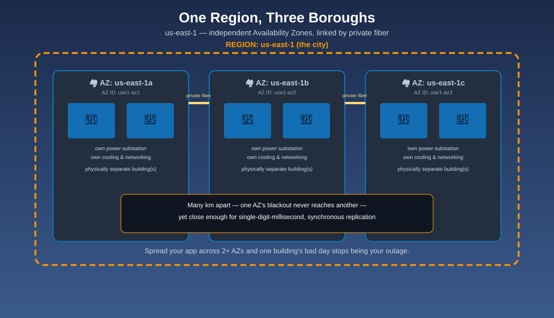

# Availability Zones — The Boroughs Inside the City

## 🏘️ The mnemonic

Inside every city (Region), AWS builds several independent **boroughs**. Each borough has its own power substation, its own water main, its own fire department — its own everything, physically. But every borough is wired to its siblings by private, dedicated tunnels, fast enough that they can act like one city day-to-day. That's an **Availability Zone (AZ)**: one or more discrete data centers, with fully independent power, cooling, and networking, connected to the other AZs in the same Region by high-bandwidth, low-latency private links.

## What actually makes an AZ independent

| Independent per AZ | Shared across AZs (same Region) |
|---|---|
| Power supply and backup generators | The Region's name and geography |
| Cooling systems | Your VPC (a VPC spans the whole Region — see the upcoming VPC folder) |
| Physical building(s) and networking hardware | Private high-bandwidth, low-latency fiber connecting every AZ |
| Flood/fire/local-disaster exposure | — |

AZs within a Region are physically separated by a meaningful distance — many kilometers apart — specifically so that one AZ's power outage, fire, or flood doesn't touch its neighbors. At the same time, they're kept close enough to each other that the private links between them run at very low, single-digit-millisecond latency, making **synchronous replication** across AZs practical (a database can safely wait for a second AZ to confirm a write, without users noticing the delay).

**Mnemonic:** *"Far enough apart that one borough's blackout never reaches the next. Close enough together that they still finish each other's sentences (sub-millisecond replication)."*

## AZ names vs. AZ IDs

Within your own account, a Region's Availability Zones are labeled `us-east-1a`, `us-east-1b`, `us-east-1c`, and so on. Here's the catch: **`us-east-1a` in your account is not necessarily the same physical AZ as `us-east-1a` in someone else's account.** AWS intentionally randomizes the mapping of AZ *names* to the underlying AZ *IDs* (a stable identifier like `use1-az1`) per account, to spread load evenly across the real physical AZs instead of everyone piling into "zone a."

**Mnemonic:** *"Two neighbors calling their borough 'downtown' doesn't mean they live in the same borough."* If you need to guarantee two resources (in two accounts) truly share, or truly avoid, the same physical AZ, compare **AZ IDs**, never AZ names.

## Why this is the cheapest availability win you get

A single AZ is still a single building's worth of risk: power, cooling, or a fiber cut can take the whole thing down. Running your workload across **two or more AZs in the same Region** costs you almost nothing extra in latency (the private links are that fast) but removes an entire class of outage from your risk profile.

| Deployment | Survives an AZ failure? |
|---|---|
| Single AZ | No — that AZ's failure is your outage |
| Multi-AZ (same Region) | Yes — traffic and data shift to a surviving AZ |

This is why so many managed AWS services default to, or strongly recommend, Multi-AZ: RDS Multi-AZ deployments keep a synchronously replicated standby in a second AZ; an Application Load Balancer distributes across AZs automatically; an Auto Scaling group is normally configured to spread instances across multiple AZs on purpose.

## Next up

A borough's high street still has corner stores in every neighborhood beyond it — the part of the map that isn't organized into cities and boroughs at all: [Edge Locations & CloudFront](edge-locations-and-cloudfront.md).

[^aws-regions-azs-2]: AWS Documentation, "Regions and Availability Zones."
