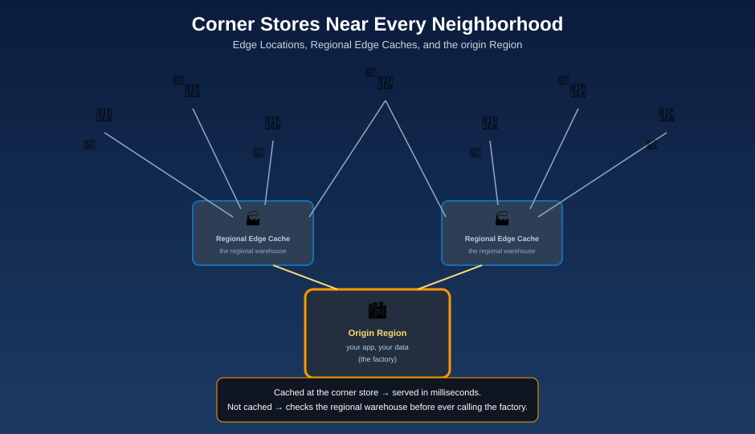

# Edge Locations & CloudFront — The Corner Stores

## 🏪 The mnemonic

Regions and Availability Zones are cities and boroughs — expensive, fully-equipped places, and there aren't many of them. **Edge Locations** are corner stores: small, cheap to place, and scattered near practically every neighborhood on the planet — hundreds of them, vastly outnumbering Regions. A corner store doesn't manufacture anything; it just stocks what's popular, close to the customer, so nobody has to drive downtown for a carton of milk.

## What an Edge Location actually does

An Edge Location is a point of presence for **Amazon CloudFront**, AWS's content delivery network (CDN). When a user requests content:

1. Their request routes to the **nearest Edge Location**, not to your origin Region.
2. If that Edge Location already has the content cached, it serves it immediately — no trip back to the origin at all.
3. If not, the Edge Location fetches it once from the origin, serves the user, and caches it for the next nearby request.

**Mnemonic:** *"The corner store doesn't stock everything — just what your neighborhood asks for most."*

## Regional Edge Caches — the warehouse behind the corner stores

Between the Edge Locations and your origin sits a smaller set of larger **Regional Edge Caches**. They hold a broader range of content, for longer, than any single Edge Location does. When a nearby corner store doesn't have what you want in stock, it checks the regional warehouse before ever bothering the original city.

**Mnemonic:** *"The corner store checks the regional warehouse before it ever calls the factory (your origin)."*

## Points of Presence — the on-ramp to AWS's backbone

**Points of Presence (PoPs)** is AWS's collective term for Edge Locations and Regional Edge Caches together — the entry points onto AWS's private global network backbone. Once traffic reaches a PoP, it travels the rest of the way to your origin Region over AWS's own high-speed network rather than the public internet, which is often faster and more reliable than a direct public-internet route would be.

## What else runs at the edge

Edge Locations aren't just a cache for CloudFront — several other AWS services use the same network of PoPs:

| Service | What it does at the edge |
|---|---|
| **Amazon CloudFront** | Caches and serves content from the nearest Edge Location |
| **Amazon Route 53** | Resolves DNS queries from the nearest edge point, and can route users to the lowest-latency endpoint |
| **AWS Global Accelerator** | Routes traffic onto the AWS backbone at the nearest edge, improving performance for non-cacheable, dynamic traffic |
| **Lambda@Edge / CloudFront Functions** | Run your own lightweight code at the edge, close to the user, before a request ever reaches your origin |
| **AWS Shield** | Absorbs and mitigates DDoS traffic at the edge, before it can reach your origin Region |

**Mnemonic:** *"The corner store isn't just a fridge — it also has a security guard (Shield), a phone line to the right city (Route 53), and a clerk who can handle simple requests on the spot (Lambda@Edge)."*

## Why this matters for your architecture

Without edge caching, every user on Earth makes a round trip to your one origin Region — great for someone next door to it, painful for someone on the other side of the planet. Putting CloudFront in front of your Region means most users are served from a corner store a few milliseconds away, regardless of how far your actual origin city is.

## Next up

Sometimes even the nearest corner store isn't close enough — for that, AWS builds small satellite outposts even nearer to specific customers: [Local Zones & Wavelength Zones](local-zones-and-wavelength-zones.md).

[^aws-cloudfront-edge]: Amazon CloudFront, "Features," aws.amazon.com/cloudfront/features.
