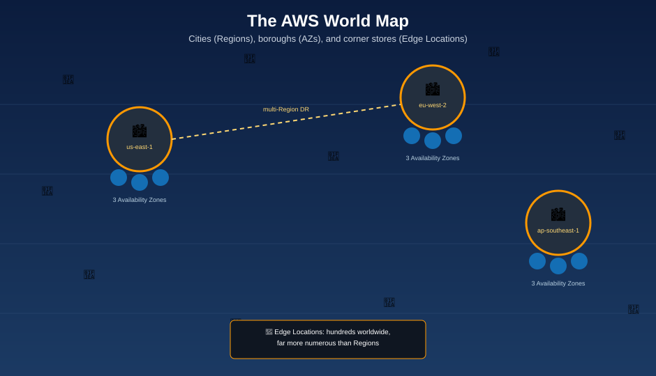

# AWS Global Infrastructure — The World Map

**AWS runs its own physical world map: independent cities, self-sufficient boroughs inside each city, and corner stores near every neighborhood on Earth.**

A **Region** is a **city** — fully independent, with its own everything. Inside that city, an **Availability Zone** is a **borough**: its own power substation, its own water supply, its own fire department, connected to its sibling boroughs by private high-speed tunnels — so one borough's blackout never touches the next. An **Edge Location** is a **corner store** near every neighborhood on the planet, stocking the popular stuff so nobody has to drive downtown for it. And when a single corner store or borough still isn't close enough to your customer, AWS will build a small satellite outpost — a **Local Zone** or **Wavelength Zone** — right in their backyard.

| World-map piece | AWS concept |
|---|---|
| 🌍 The world map itself | **AWS Global Infrastructure** |
| 🏙️ A city — fully independent, its own everything | A **Region** — an isolated geographic area, e.g. `us-east-1` |
| 🏘️ A borough — its own power, water, and fire department, linked to its siblings by private tunnels | An **Availability Zone (AZ)** — one or more discrete data centers with independent power/cooling/networking |
| 🏢 A single building inside a borough | A **data center** — the physical facility itself |
| 🏪 A corner store near every neighborhood, stocking what's popular so nobody drives downtown | An **Edge Location** — a CloudFront cache point close to end users |
| 🛣️ The on-ramp connecting a neighborhood's corner stores to the citywide backbone | A **Point of Presence (PoP)** — collectively, edge locations and regional edge caches |
| 🏬 A small satellite outpost mall built in a nearby suburb, without becoming its own city | A **Local Zone** — extends a Region closer to a specific metro area |
| 📡 A kiosk built right inside the phone company's own building | A **Wavelength Zone** — AWS compute embedded in a telecom's 5G network |
| 📦 A shipping container of city infrastructure, dropped inside a customer's own warehouse | **AWS Outposts** — real AWS hardware, running in your own data center |
| 👯 Twin cities built continents apart, so one city's earthquake never reaches the other | A **multi-Region architecture** — disaster recovery across independent Regions |

## Read in this order

1. [What is AWS Global Infrastructure?](what-is-global-infrastructure.md) — the whole map, zoomed out
2. [Regions](regions.md) — the cities, and how to pick the right one
3. [Availability Zones](availability-zones.md) — the boroughs, and why they never share one blackout
4. [Edge Locations & CloudFront](edge-locations-and-cloudfront.md) — the corner stores, and the network that connects them
5. [Local Zones & Wavelength Zones](local-zones-and-wavelength-zones.md) — satellite outposts, closer than a Region can reach
6. [Designing for High Availability](designing-for-high-availability.md) — building across boroughs and cities on purpose
7. [Best Practices](best-practices.md) — how to actually use the map
8. [Mnemonics Cheat Sheet](mnemonics-cheatsheet.md) — the one page to review before an exam or interview
9. [Glossary](glossary.md) — every term, one line each

## Official AWS references

* [AWS Global Infrastructure](https://aws.amazon.com/about-aws/global-infrastructure/)
* [Regions and Availability Zones](https://docs.aws.amazon.com/AWSEC2/latest/UserGuide/using-regions-availability-zones.html)
* [Amazon CloudFront — Edge locations](https://aws.amazon.com/cloudfront/features/)
* [AWS Local Zones](https://aws.amazon.com/about-aws/global-infrastructure/localzones/)
* [AWS Wavelength](https://aws.amazon.com/wavelength/)

See [log.md](log.md) for this folder's update history.
