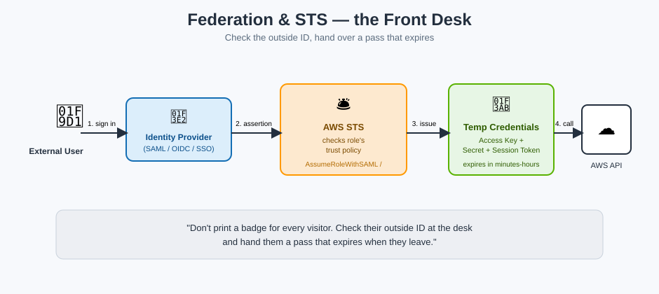

# Federation & STS — the Front Desk

## 🛎️ The mnemonic

**Federation** means trusting an **outside identity office** — your company's Active Directory, Okta, Google, or a corporate SAML/OIDC provider — instead of printing every visitor their own permanent building badge.

**AWS STS (Security Token Service)** is the **front desk**: it checks the visitor's outside ID against the trust list, and if it matches, hands over a **temporary visitor pass** (short-lived credentials) — never a permanent badge.

**Mnemonic:** *"Don't print a badge for every visitor. Just check their outside ID at the desk and hand them a pass that expires when they leave."*

## The flow, step by step

1. A user signs in to an **external identity provider** (IdP) — corporate SSO, Google Workspace, an Active Directory via SAML, or a social login via OIDC.
2. The IdP vouches for the user and hands back an assertion/token.
3. The application calls **AWS STS** (`AssumeRoleWithSAML`, `AssumeRoleWithWebIdentity`, or via **IAM Identity Center**), presenting that assertion.
4. STS checks the **role's trust policy** — "does this role trust this identity provider?" — and if yes, issues **temporary security credentials**: an access key, secret key, and session token, valid from minutes up to hours.
5. The user/application uses those temporary credentials to call AWS services, scoped exactly to the role's permissions policy.

## Why this beats creating an IAM user per outsider

| Approach | Problem |
|---|---|
| Create an IAM user for every employee/partner | Credentials to manage, rotate, and eventually forget about; doesn't scale past a handful of people |
| Federation + STS | Zero IAM users created; access is only as good as the outside login, and it **expires automatically** |

## The STS API calls worth knowing by name

| Call | When you'd use it |
|---|---|
| `AssumeRole` | One AWS principal (user/role) assuming a role, same or cross-account |
| `AssumeRoleWithSAML` | Enterprise SSO via SAML 2.0 (e.g. Active Directory Federation Services) |
| `AssumeRoleWithWebIdentity` | Login via a public OIDC provider (Google, Facebook, Amazon Cognito) |
| `GetSessionToken` | A logged-in IAM user requesting their own short-term credentials (e.g. to enable an MFA-required action) |
| `GetFederationToken` | Granting a limited-permission temporary session to a federated user without a role (legacy pattern, largely superseded by roles) |

## Key facts to lock in

- Federated access **always** results in temporary credentials — there is no such thing as a permanent federated login to raw AWS APIs.
- **IAM Identity Center** (formerly AWS SSO) is AWS's managed way to wire up federation across many accounts at once without hand-building STS calls yourself.
- The visitor pass (temporary credentials) can be revoked early by tightening or removing the trust policy — you don't have to wait for it to expire.

## Next up

Roles and boundaries can be layered so that even a fully-trusted visitor can't wander past a certain point: [Permission Boundaries & SCPs](permission-boundaries-and-scps.md).

[^aws-iam-federation]: AWS IAM User Guide, "Identity providers and federation."
[^aws-sts]: AWS Security Token Service API Reference.
