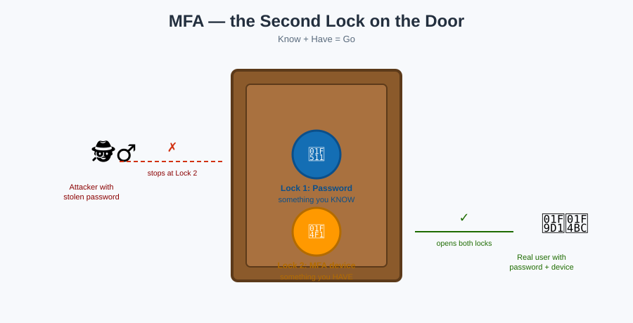

# MFA — the Second Lock on the Door



## 🔐 The mnemonic

A badge (password) can be photographed, phished, or copied. **MFA adds a second lock that a stolen badge photo alone can't open** — something the real badge holder *has* (a device) or *is* (biometrics), not just something they *know* (a password).

**Mnemonic:** *"Know + Have = Go."* One factor gets you nothing; you need a factor you **know** (password) plus a factor you **have** (device/token) to walk through the door.

## Types of MFA devices AWS supports

| Type | What it is | Mnemonic |
|---|---|---|
| **Virtual MFA** | An authenticator app (Google Authenticator, Authy) generating a 6-digit code | "The code that refreshes every 30 seconds" |
| **Hardware TOTP token** | A physical fob (e.g. a YubiKey-style token) generating rotating codes | "The keychain fob" |
| **FIDO Security Key** | A physical USB/NFC key using public-key cryptography, phishing-resistant | "The key that can't be phished because it checks the website itself" |

## Where to require it

- **Root user** — non-negotiable; see [Root User](root-user.md).
- **Console sign-in for privileged users** — anyone with admin-level access.
- **Sensitive API calls** — enforce via a policy `Condition`:

```json
"Condition": {
  "BoolIfExists": { "aws:MultiFactorAuthPresent": "false" }
}
```
— paired with `"Effect": "Deny"`, this denies an action **unless** MFA was used for the current session.

## Key facts to lock in

- MFA is attached to an **IAM user**, not a role — but a role's session can *require* that the user who assumed it had MFA active at assume-time (`aws:MultiFactorAuthPresent` in the trust policy condition).
- Losing an MFA device doesn't lock you out forever — an account administrator (or root, as a last resort) can deactivate/reassign it.
- MFA does **not** replace strong password policies — it's an *additional* lock, not a swap.

## Next up

Sometimes the person who needs to walk in isn't an employee at all — they work for a different company, or they're signing in through your corporate SSO. That's what [Federation & STS](federation-and-sts.md) is for.

[^aws-iam-mfa]: AWS IAM User Guide, "Using multi-factor authentication (MFA) in AWS."
