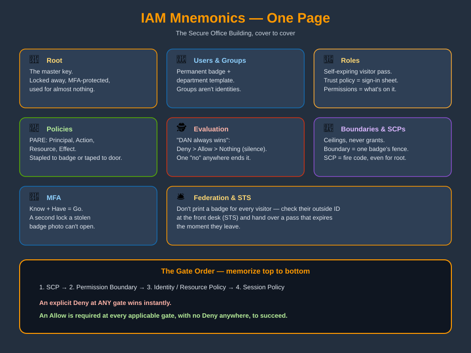

# The One-Page IAM Cheat Sheet



## The building, in one picture

| Building piece | IAM concept |
|---|---|
| 🏢 The building | Your AWS account |
| 🔑 Master key | Root user — locked in a drawer, MFA-protected |
| 🪪 Employee badge | IAM User — permanent, one owner |
| 🗂️ Department badge template | IAM Group — a bundle of policies, not an identity |
| 🎫 Self-expiring visitor pass | IAM Role — temporary, assumed, no owner |
| 📜 Rulebook page | IAM Policy — JSON: Who / What / Which room / Allow or Deny |
| 🚧 Fence around one badge | Permission Boundary — a ceiling, never a grant |
| 🏛️ Company-wide fire code | Service Control Policy (SCP) — caps every account, even root |
| 🔐 Second lock on the door | MFA — know + have = go |
| 🛎️ Front desk issuing passes | AWS STS — federation's temporary-credential machine |
| 🕵️ The guard | Policy evaluation engine |

## The five mnemonics worth memorizing word-for-word

1. **"DAN always wins the argument."** — Deny beats Allow beats Nothing (silence = implicit deny).
2. **"No signs = no entry. A yes sign helps. A no sign anywhere ends the conversation."** — the full evaluation summary across every gate (SCP → boundary → identity/resource → session).
3. **"Trust policy = the sign-in sheet. Permissions policy = what's printed on the badge."** — the two documents that define every role.
4. **"Know + Have = Go."** — MFA needs a factor you know plus a factor you have.
5. **"Don't print a badge for every visitor — check their outside ID and hand them a pass that expires."** — federation + STS in one sentence.

## The gate order (memorize top to bottom)

```
1. SCP                         — company fire code (whole org)
2. Permission Boundary         — fence around this one badge
3. Identity / Resource Policy  — the rulebook itself
4. Session Policy              — extra limit set at assume-role time
```

An explicit **Deny** at *any* gate wins instantly. An **Allow** must exist at every gate that applies, with no Deny anywhere, for access to succeed.

## Speed-round definitions

| Term | One line |
|---|---|
| User | Permanent badge, one owner |
| Group | Policy bundle for many users, not an identity |
| Role | Temporary pass, assumed by trusted principals, no owner |
| Policy | JSON rulebook page: Principal / Action / Resource / Effect |
| Identity-based policy | Rule stapled to the badge |
| Resource-based policy | Sign taped to the door |
| Permission boundary | Ceiling on one badge's max permissions |
| SCP | Ceiling on an entire account/OU/Organization, even root |
| MFA | Second lock: know + have |
| STS | Front desk issuing temporary passes |
| Federation | Trusting an outside identity office instead of printing a badge |

For full definitions of every term, see the [Glossary](glossary.md). To go deeper on any single row, jump back to the [folder index](index.md).
