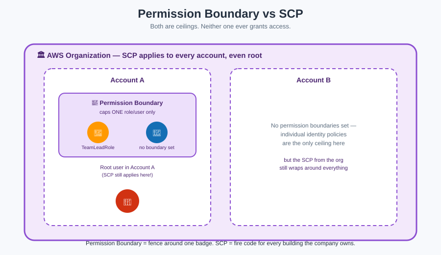

# Permission Boundaries & SCPs — Fences Within Fences



Both of these concepts do the **same job at different scales**: they cap the *maximum possible* permission, no matter how generous the rulebook stapled to the badge is. Neither one **grants** anything by itself — they only set a ceiling.

**Mnemonic:** *A ceiling never lifts you up. It only stops you from going higher, even if the rulebook says you can.*

## 🚧 Permission Boundary — the fence around one badge

A **permission boundary** is a policy attached to **one specific user or role** that sets the maximum permissions *that identity* can ever have — regardless of what its identity-based policies say.

**Mnemonic:** *"Even if the badge's rulebook says the whole third floor, the fence around this one badge only goes up to Room 12."*

**Effective permissions = the intersection of the identity policy AND the permission boundary.** Both must say yes.

### Classic use case

A team lead needs to create IAM roles for their own team's Lambda functions, but you don't want them accidentally (or deliberately) creating a role more powerful than they are. You give them `iam:CreateRole`, but **require** that any role they create has a permission boundary attached — so no role they create can ever exceed that boundary, even if they attach `AdministratorAccess` to it by mistake.

## 🏛️ Service Control Policy (SCP) — the fire code for the whole company

An **SCP** operates one level up, in **AWS Organizations**. It's not attached to a user or role — it's attached to an **AWS account, an Organizational Unit (OU), or the whole Organization**, and it caps what **every single identity in that account** can ever do, including that account's own root user.

**Mnemonic:** *"The fire code applies to every room in every building the company owns — even the CEO's office. No local rulebook can override it."*

### Key differences at a glance

| | Permission Boundary | SCP |
|---|---|---|
| Scope | One user or role | An account / OU / whole Organization |
| Set by | Account administrators | AWS Organizations management account |
| Applies to root user? | N/A (boundaries aren't attached to root) | **Yes** — SCPs cap even the root user |
| Requires | Nothing special | An AWS Organization to exist |
| Grants permissions? | Never — only caps | Never — only caps |

## The full gate order, revisited

This is exactly Gate 0 and Gate 1 from [Policy Evaluation Logic](policy-evaluation-logic.md):

```
SCP (fire code, whole org)
  └─ Permission Boundary (fence around this one badge)
        └─ Identity / Resource policy (the rulebook itself)
```

An explicit Deny — or simply the *absence* of an Allow — at any layer stops the request, no matter how permissive the layers inside it are.

## Key facts to lock in

- Both boundaries and SCPs are written in the **same JSON policy language** as regular policies.
- Neither one ever grants access on its own — you still need an identity or resource policy with an explicit Allow.
- SCPs require **AWS Organizations**; permission boundaries work in any single account.

## Next up

Now that you know every piece of the building, see them all applied together: [Best Practices](best-practices.md).

[^aws-permission-boundary]: AWS IAM User Guide, "Permissions boundaries for IAM entities."
[^aws-scp]: AWS Organizations User Guide, "Service control policies (SCPs)."
