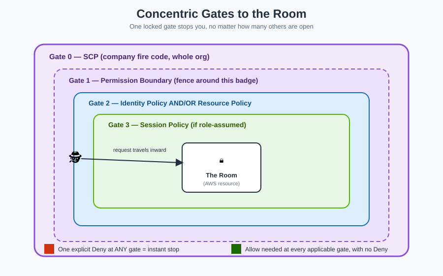

# Policy Evaluation Logic — How the Guard Decides

This is the concept people forget fastest — and the one most exam questions and real outages hinge on. Two mnemonics fix that for good.

## 🕵️ Mnemonic #1 — "DAN always wins the argument"

For **any single rule source**, three outcomes are possible, and they rank in this order of power:

> **D**eny beats **A**llow beats **N**othing.

- **D**eny — an explicit "NO ENTRY" sign. Always wins. Full stop.
- **A**llow — an explicit "YES, come in" sign. Wins *only if no Deny sign exists anywhere*.
- **N**othing (silence) — no sign at all = **implicit deny**. AWS's default answer to everything is "no."

**Mnemonic sentence:** *"Silence means no, a sign saying yes overrides silence, but a sign saying no overrides everything."*

## 🚧 Mnemonic #2 — "Concentric gates around the room"

To reach a room deep inside the building, your request has to pass through **every gate** standing between the front door and that room. **Any single locked gate stops you — it doesn't matter how many other gates are open.**

Walking from the outside in:

1. **Gate 0 — SCP** (Service Control Policy, set by AWS Organizations, building-wide fire code — only relevant if you're in an AWS Organization)
2. **Gate 1 — Permission Boundary** (the badge's own fence, if one is set)
3. **Gate 2 — Identity-based policy** (what's stapled to the badge) **and/or** **Resource-based policy** (what's taped to the door) — for a same-account request, either one saying Allow is generally enough; for cross-account, *both sides* must say Allow
4. **Gate 3 — Session policy** (an extra, temporary restriction passed in when a role was assumed, if any)

**The rule that ties it all together:** at *every* gate that applies, an explicit **Deny** anywhere instantly ends the journey. To get an **Allow**, *every applicable gate* must either say Allow or simply not apply — there must be no Deny anywhere, and there must be at least one Allow where required.

## Worked example

> Priya's IAM user has an identity policy allowing `s3:GetObject` on `project-photos/*`. Her permission boundary also allows S3 read actions. But the SCP for her whole AWS Organization explicitly **denies** all S3 access outside business hours.

**Result: Denied.** It doesn't matter that two out of three gates say yes — Gate 0 (the SCP) has an explicit Deny, and Deny always wins, no matter which gate it comes from.

## Common traps this logic explains

| Symptom | What's really happening |
|---|---|
| "I attached `AdministratorAccess` but the user still can't do X" | Something else — an SCP, a permission boundary, or another statement — has an explicit Deny on X |
| "It works for User A but not User B, same group" | B might have an inline policy or boundary with an extra Deny that A doesn't have |
| "Cross-account access fails even though both sides look right" | One side (identity **or** resource policy) is missing the explicit Allow — cross-account needs both |
| "A brand-new user can't do anything at all" | Correct and expected — the default, with zero policies attached, is implicit deny on everything |

## The one-line summary to memorize

> **"No signs = no entry. A yes sign helps. A no sign anywhere ends the conversation."**

## Next up

One of the strongest "no" signs a security team can post is a second lock on the front door itself: [MFA](mfa.md).

[^aws-iam-eval]: AWS IAM User Guide, "Policy evaluation logic."
