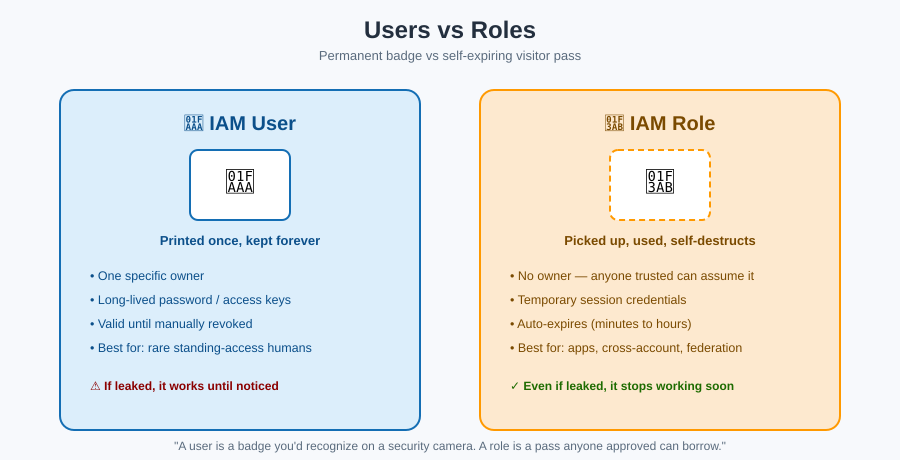

# Roles — the Self-Expiring Visitor Pass



## 🎫 The mnemonic

A **role** is a **visitor pass** sitting at the front desk. Nobody owns it. Anyone on the approved list can walk up, sign for it, wear it for a few hours, and it **expires and stops working on its own** — no one has to remember to collect it back.

Compare that to a **user's** badge: printed once, handed to one person, valid forever until someone manually deactivates it.

| | 🪪 User | 🎫 Role |
|---|---|---|
| Owner | One specific person/app, forever | Nobody — it's "assumed," not owned |
| Credentials | Long-lived (password / access keys) | Temporary (auto-expiring session tokens, minutes to hours) |
| Who can use it | Only that one identity | Anyone/anything listed in its **trust policy** |
| Best for | Rare: a specific human that truly needs standing access | Almost everything else: apps, cross-account access, federated users, temporary elevation |

## The two documents every role has

A role is defined by **two** separate policies — mixing these up is the #1 source of role confusion:

1. **Trust policy** ("who can pick up this pass?") — defines *which principals* are allowed to assume the role (an AWS service, another account, a federated identity provider).
2. **Permissions policy** ("what can the pass-holder do once inside?") — defines what the role can actually do, same as a user's attached policies.

**Mnemonic:** *Trust policy = the front desk's sign-in sheet. Permissions policy = what's printed on the badge itself.*

```json
// Trust policy: "EC2 instances may pick up this pass"
{
  "Effect": "Allow",
  "Principal": { "Service": "ec2.amazonaws.com" },
  "Action": "sts:AssumeRole"
}
```

## Common everyday uses of roles

- **EC2 instance role**: your server assumes a role instead of having AWS credentials hardcoded on disk.
- **Cross-account access**: Account B's role trusts Account A, so an engineer in Account A can assume it without ever getting a user in Account B.
- **AWS Lambda execution role**: your function assumes a role every time it runs.
- **Federated login**: an employee signs in with corporate SSO and is handed a role's temporary credentials — see [Federation & STS](federation-and-sts.md).

## Key facts to lock in

- Assuming a role calls `sts:AssumeRole` and returns **temporary credentials** (access key, secret key, session token) that expire — from 15 minutes up to 12 hours by default.
- A role has **no long-term password or access keys of its own** — that's the entire point.
- You can assume a role even from **outside** the account that owns it, which is how cross-account access works without ever sharing a permanent badge.

## Next up

Both users and roles need a rulebook to know what they can do — that's [Policies](policies.md).

[^aws-iam-roles]: AWS IAM User Guide, "IAM roles."
