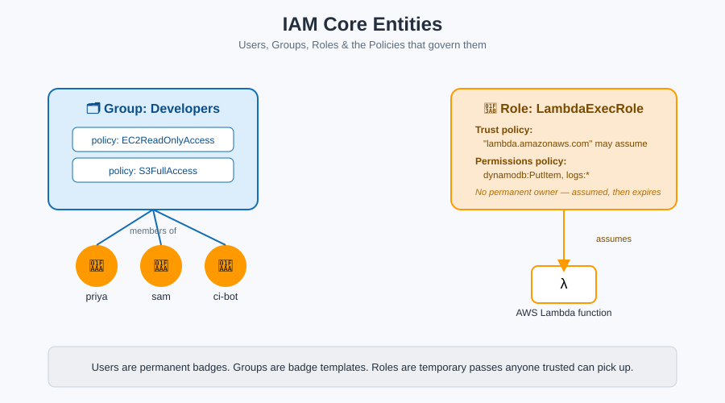

# Users & Groups — Badges and Departments



## 🪪 Users: the permanent employee badge

An **IAM user** is a named, permanent identity — like an employee badge with a photo on it. It has:

- A name (`priya`, `ci-deploy-bot`)
- Optionally, a password (for AWS Console sign-in)
- Optionally, access keys (for CLI/API/SDK access)
- Optionally, MFA attached

**Mnemonic:** *A user is a name you'd recognize on a security camera.* If it's a specific person or a specific long-lived application, it's a user.

### The catch with users

Badges left lying around are a security risk. An IAM user's credentials are **long-lived by default** — if an access key leaks, it works until someone notices and revokes it. This is exactly why AWS increasingly pushes people toward [Roles](roles.md) (temporary passes) instead of permanent users, especially for applications.

## 🗂️ Groups: the department badge template

A **group** is not an identity — nothing can "log in as" a group. It's a **named bundle of policies** that you attach to multiple users at once.

**Mnemonic:** *A group is the laminated instruction sheet at the badge printer for the "Finance" department.* Every new hire in Finance gets a badge printed from the same template — you edit the template once, and everyone in it updates together.

### Why groups matter

Without groups, you'd attach the same five policies to fifty different users — and forget to update one of them when the rules change. With groups:

```
Group: Developers
 ├─ policy: AmazonEC2ReadOnlyAccess
 └─ policy: AmazonS3FullAccess

User: priya   → member of Developers
User: sam     → member of Developers
User: ci-bot  → member of Developers
```

Update the group's policies once, and all three users' effective permissions change instantly.

## Rules worth memorizing

| Rule | Why it matters |
|---|---|
| A user can belong to **up to 10 groups** | Plan your department structure; don't over-fragment |
| **Groups cannot be nested** (no group-of-groups) | Keep group hierarchies flat |
| **Groups cannot be a principal** in a trust policy | Only users, roles, and accounts can *assume* something — groups just hold policies |
| Default: **a brand-new user can do nothing** | Access is opt-in, never opt-out — see [Policy Evaluation Logic](policy-evaluation-logic.md) |

## Next up

Badges are permanent. But what about giving temporary access to a contractor, another AWS service, or someone from a different company entirely? That's what [Roles](roles.md) are for.

[^aws-iam-users]: AWS IAM User Guide, "IAM users."
