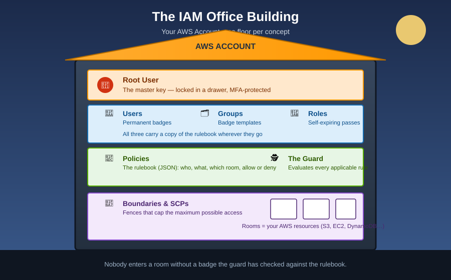

# What is AWS IAM?

**IAM (Identity and Access Management)** is the service that answers two questions, every single time someone or something tries to do anything in your AWS account:

1. **Who are you?** (Authentication)
2. **Are you allowed to do that, to this?** (Authorization)

## 🏢 The mnemonic: Your account is a building

Picture your AWS account as **one secure office building**. IAM is the building's entire security operation — the front desk, the badges, the rulebook, and the guard standing at every door.

* The **building** is your AWS account.
* Every **room** is an AWS resource (an S3 bucket, an EC2 instance, a DynamoDB table).
* Nobody — not even a script — walks through a door without showing a **badge** and having the **guard** check the **rulebook**.

Hold onto this picture. Every other IAM doc in this folder just adds one more piece of furniture to the same building.[^aws-iam-intro]

## Why IAM exists

Without IAM, anyone with your AWS account's master key could do *anything* — read every file, delete every database, spin up thousands of dollars of servers. IAM lets you hand out **narrow, specific, revocable** permissions instead of the master key itself.

> **Golden rule:** Nobody carries the master key day-to-day. Everybody carries the smallest badge that lets them do their job. This is called the **Principle of Least Privilege**, and it's the single most important idea in all of IAM.

## The five things IAM manages

| Piece | One-line definition | Full doc |
|---|---|---|
| 👤 **Users** | A permanent identity for a specific person or application | [Users & Groups](users-and-groups.md) |
| 🗂️ **Groups** | A named collection of users that share the same permissions | [Users & Groups](users-and-groups.md) |
| 🎫 **Roles** | A temporary identity that anyone (or anything) trusted can *assume* | [Roles](roles.md) |
| 📜 **Policies** | The JSON document that spells out what's allowed or denied | [Policies](policies.md) |
| 🔐 **MFA / Root user controls** | Extra locks on the most sensitive doors | [MFA](mfa.md), [Root User](root-user.md) |

## Key facts to lock in

- IAM is **global**, not regional — a user or role you create exists across all AWS regions at once.
- IAM is **free** to use. You pay for what your identities *do* (the EC2 instance, the S3 storage), not for IAM itself.
- IAM is **eventually consistent** — a permission change can take a few seconds to propagate everywhere.

## Next up

Start at the top of the building's org chart: [The Root User](root-user.md) — the one identity you should almost never use.

[^aws-iam-intro]: AWS IAM User Guide, "What Is IAM?"
