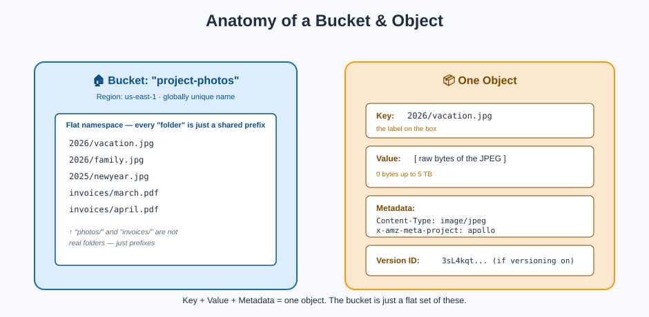

# Buckets & Objects — Units and Boxes

## 🏠 Buckets: the storage unit you rent

A **bucket** is a top-level container for objects. Renting one means picking a **name** and a **Region** — and both decisions matter more than they look.

### Naming rules (memorize these — they bite people constantly)

- Globally unique across **all of AWS**, all accounts, all regions — like a domain name
- 3–63 characters, lowercase letters, numbers, hyphens and dots only
- Must start and end with a letter or number
- Can't look like an IP address (`192.168.1.1`)
- Can't start with `xn--`, `sthree-`, or end with `-s3alias` (reserved AWS prefixes/suffixes)

**Mnemonic:** *A bucket name is a domain name's cousin — unique everywhere, boring on purpose.*

### The Region decision is permanent

You pick a Region when you create the bucket, and **you cannot move a bucket to another Region later** — you can only copy/replicate its contents into a new bucket in a different Region. Pick the Region closest to your primary users or workloads up front.

## 📦 Objects: the boxes inside the unit

An object is the actual thing you're storing, and it's really three parts glued together:

| Part | What it is | Example |
|---|---|---|
| **Key** | The object's full name/path | `invoices/2026/march/inv-004.pdf` |
| **Value** | The bytes themselves | the PDF's binary content |
| **Metadata** | Name/value pairs describing the object | `Content-Type: application/pdf`, custom tags |
| **Version ID** | Which edition of the object this is (if versioning is on) | `null` or a unique version string |

- Minimum object size: **0 bytes** (yes, an empty object is valid)
- Maximum object size: **5 TB**
- Anything over 5 GB in a single upload **must** use [multipart upload](performance-and-transfer.md)

## 🚨 The single most-missed fact: folders are fake

S3 has **no real directory structure**. A bucket is a **flat namespace** of keys. When the console shows you a "folder" called `photos/`, it's really just grouping every key that shares the prefix `photos/` — there's no actual folder object underneath (unless you explicitly create a zero-byte object with a trailing slash, which some tools do for compatibility).

**Mnemonic:** *"Folders" in S3 are the warehouse showing you boxes grouped by the first part of their label — the label itself is one long string, `photos/2026/vacation.jpg`, not a nested set of real folders.*

This matters because:
- Listing "a folder" (`ListObjectsV2` with a `Prefix`) is a **string-matching operation**, not a directory lookup.
- Renaming a "folder" means **copying every object to a new key and deleting the old ones** — there's no atomic rename.
- Performance planning should think in terms of **key design**, not folder depth (see [Performance & Transfer](performance-and-transfer.md)).

## Object metadata, two flavors

1. **System-defined metadata** — things S3 itself manages or needs: `Content-Type`, `Content-Length`, `ETag`, `Last-Modified`.
2. **User-defined metadata** — custom key/value pairs you attach, prefixed `x-amz-meta-*`, e.g. `x-amz-meta-project: apollo`.

There's also **object tags** — a separate mechanism (up to 10 key/value pairs) used for things metadata isn't: driving [lifecycle rules](lifecycle-management.md), access control conditions, and cost allocation reports. **Tags are for classification and automation; metadata is for describing the object's content.**

## Next up

Not every box belongs on the same shelf — see every option in [Storage Classes](storage-classes.md).

[^aws-s3-buckets]: Amazon S3 User Guide, "Buckets overview."
[^aws-s3-objects]: Amazon S3 User Guide, "Amazon S3 objects overview."
