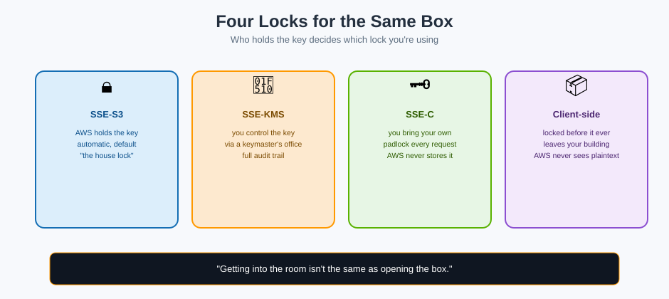

# Encryption — Every Lock You Can Put on a Box



## 🔐 The mnemonic

Getting past the door (see [Security & Access Control](security-and-access-control.md)) doesn't mean the box is readable — encryption is a **separate lock on the box itself**. The four options differ in exactly one question: **who holds the key, and who's responsible for managing it?**

**Mnemonic:** *"Getting into the room isn't the same as opening the box — encryption is the second problem, solved independently of the first."*

## Encryption at rest: the four options

| Type | Who manages the key | Mnemonic |
|---|---|---|
| **SSE-S3** | AWS, fully, using AES-256 | "The warehouse's own house lock — free, automatic, zero setup" |
| **SSE-KMS** | You, via AWS Key Management Service | "You hold the master key at a separate keymaster's office — extra audit trail, extra control, extra cost" |
| **SSE-C** | You, entirely — you supply the key on every request | "Bring your own padlock every single time; the warehouse never keeps a copy" |
| **Client-side encryption** | You, before the box ever leaves your building | "You lock the box before it even reaches the delivery truck — the warehouse never sees the unlocked contents" |

Since January 2023, **SSE-S3 encryption is applied to every new object by default** — there's no longer an "unencrypted" option for new uploads; the only real choice is whether to upgrade to SSE-KMS for more control.

## SSE-KMS — the one with the most moving parts, and the most control

SSE-KMS uses a **KMS key** (either the AWS-managed default, or a customer-managed key you create) and adds:

- **A full audit trail** in CloudTrail of every time the key was used to encrypt or decrypt
- **Fine-grained key policies** — you can require a specific IAM role to even be *capable* of decrypting, independent of the S3 bucket policy entirely
- **Automatic key rotation**, if enabled
- A small **per-request cost** for calls to KMS, and a **request-rate quota** on KMS itself that can matter at very high throughput

**Mnemonic:** *"SSE-KMS adds a second guard who checks a second rulebook, purely for the key itself — even someone who can open the bucket's door might still not be allowed to turn this particular lock."*

## Encryption in transit — the delivery truck itself

Separate from at-rest encryption, S3 supports (and can **require**, via a bucket policy condition) that every request arrive over **HTTPS/TLS**:

```json
{
  "Effect": "Deny",
  "Principal": "*",
  "Action": "s3:*",
  "Resource": "arn:aws:s3:::my-bucket/*",
  "Condition": { "Bool": { "aws:SecureTransport": "false" } }
}
```

**Mnemonic:** *"At-rest encryption locks the box on the shelf. In-transit encryption locks the delivery truck. You want both."*

## Which one should you actually pick?

```
Just need "encrypted, don't care about the details"?  → SSE-S3 (the default already)
Need an audit trail of every decrypt, or key rotation
  control, or to restrict who can even use the key?    → SSE-KMS
Need to guarantee AWS itself never sees the key?        → SSE-C or client-side encryption
Regulatory requirement that data be unreadable
  before it leaves your own network?                    → Client-side encryption
```

## Next up

Sometimes the goal isn't locking a box down further — it's letting one specific person open one specific box, just once: [Sharing & Presigned URLs](sharing-and-presigned-urls.md).

[^aws-s3-encryption]: Amazon S3 User Guide, "Protecting data using encryption."
