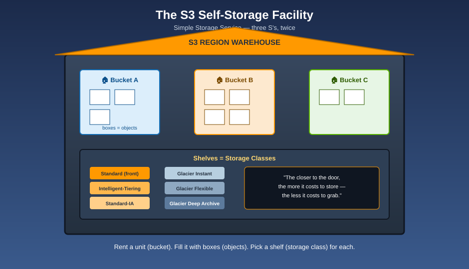

# AWS S3 — The Self-Storage Facility

**S3 officially stands for Simple Storage Service — three S's. Think of it as your own global Self-Storage Service — same three S's, and the analogy writes itself.**

S3 is a chain of self-storage warehouses spread across the planet. You rent a **unit** (bucket), you put **boxes** inside it (objects), every box has a **label** (key), and you choose which **shelf** it sits on based on how often you'll grab it again — from the shelf by the front door to a sealed vault buried in a mountain.

| Warehouse piece | S3 concept |
|---|---|
| 🏭 The warehouse chain | Amazon S3, the service |
| 🏠 One rented storage unit | A **Bucket** — globally unique name, lives in one Region |
| 📦 A box inside the unit | An **Object** — the actual data (up to 5 TB) |
| 🏷️ The label on the box | The **Key** — the object's full name/path |
| 🗄️ Which shelf the box sits on | The **Storage Class** — Standard, IA, Glacier, and more |
| 🕰️ Keeping every past edition of a box | **Versioning** |
| 🤖 A robot that moves boxes to cheaper shelves on schedule | **Lifecycle Rules** |
| 🚚 A duplicate box shipped to a sister warehouse | **Replication** |
| 📜 The building's posted rules | **Bucket Policy** |
| 🔐 Different locks you can put on a box | **Encryption** (SSE-S3, SSE-KMS, SSE-C, client-side) |
| 🎫 A one-time guest pass to open one box | A **Presigned URL** |
| 🪟 Turning your unit into a storefront window | **Static Website Hosting** |
| 🔔 A doorbell that rings when a box changes | **Event Notifications** |
| 🔒 A vault that can't be opened until a set date | **Object Lock** (WORM) |
| 📊 The company's central usage dashboard | **Storage Lens** |

## Read in this order

1. [What is S3?](what-is-s3.md) — the warehouse, the pun, and the numbers that matter
2. [Buckets & Objects](buckets-and-objects.md) — naming, structure, keys, and the "folders are fake" truth
3. [Storage Classes](storage-classes.md) — every shelf in the warehouse, compared side by side
4. [Versioning](versioning.md) — keeping every past edition of a box
5. [Lifecycle Management](lifecycle-management.md) — the robot that moves and retires boxes automatically
6. [Replication](replication.md) — shipping duplicate boxes to sister warehouses
7. [Security & Access Control](security-and-access-control.md) — bucket policies, IAM policies, ACLs, and Block Public Access
8. [Access Points](access-points.md) — separate private doors into the same warehouse
9. [Encryption](encryption.md) — every lock you can put on a box
10. [Sharing & Presigned URLs](sharing-and-presigned-urls.md) — temporary guest passes
11. [Static Website Hosting](static-website-hosting.md) — turning a unit into a storefront
12. [Performance & Transfer](performance-and-transfer.md) — multipart upload, Transfer Acceleration, request-rate scaling
13. [Consistency Model](consistency-model.md) — when a change becomes visible to everyone
14. [Data Processing & Notifications](data-processing-and-notifications.md) — Event Notifications, S3 Select, Batch Operations
15. [Object Lock & Compliance](object-lock-and-compliance.md) — the tamper-proof vault
16. [Monitoring & Cost Optimization](monitoring-and-cost-optimization.md) — Storage Lens, Inventory, logging, and saving money
17. [Best Practices](best-practices.md) — how a well-run warehouse operates
18. [Mnemonics Cheat Sheet](mnemonics-cheatsheet.md) — the one page to review before an exam or interview
19. [Glossary](glossary.md) — every term, one line each

## Official AWS references

* [Amazon S3 User Guide](https://docs.aws.amazon.com/AmazonS3/latest/userguide/Welcome.html)
* [S3 Storage Classes](https://aws.amazon.com/s3/storage-classes/)
* [S3 Best Practices](https://docs.aws.amazon.com/AmazonS3/latest/userguide/security-best-practices.html)

See [log.md](log.md) for this folder's update history.
