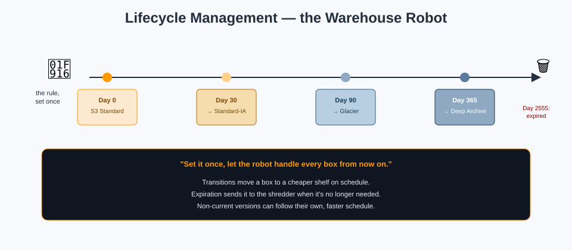

# Lifecycle Management — the Warehouse Robot



## 🤖 The mnemonic

A **lifecycle rule** is a robot you program once: *"Every night, walk the aisles. Any box matching this description, past this age, move it to that shelf — or throw it out."* You set the rule a single time; the robot runs it forever, on every matching object, without anyone lifting a finger.

**Mnemonic:** *"Set it once, let the robot handle every box from now on."*

## The two things a lifecycle rule can do

1. **Transition actions** — move an object to a cheaper [storage class](storage-classes.md) after a set number of days.
2. **Expiration actions** — delete an object (or a non-current version) after a set number of days.

```json
{
  "Rules": [{
    "ID": "archive-old-logs",
    "Filter": { "Prefix": "logs/" },
    "Status": "Enabled",
    "Transitions": [
      { "Days": 30,  "StorageClass": "STANDARD_IA" },
      { "Days": 90,  "StorageClass": "GLACIER" },
      { "Days": 365, "StorageClass": "DEEP_ARCHIVE" }
    ],
    "Expiration": { "Days": 2555 }
  }]
}
```

**Mnemonic for reading a rule:** *"Filter (which boxes?), Transitions (which shelves, and when?), Expiration (when's the shredder?)"*

## Rules can target more than a prefix

A lifecycle rule's filter can combine a **key prefix**, one or more **object tags**, and even an **object size range** — so you can write rules like "objects tagged `archive:true`, larger than 100 MB, under the `backups/` prefix."

## Lifecycle + Versioning: two separate timelines

When [versioning](versioning.md) is on, a lifecycle rule can set **different schedules for current vs. non-current versions**:

| Target | Typical rule |
|---|---|
| **Current version** | Transition to IA after 30 days, Glacier after 90 |
| **Non-current versions** | Transition to Glacier after 30 days, expire entirely after 180 |
| **Expired delete markers** | Clean up automatically once no non-current versions remain under them |
| **Incomplete multipart uploads** | Abort and delete parts left behind by failed uploads after N days — pure cost hygiene |

**Mnemonic:** *"The current box gets the VIP schedule. Its retired predecessors get shipped to storage faster and shredded sooner."*

## The trap everyone hits at least once

Transitioning an object **before** its current storage class's minimum storage duration has elapsed still bills you for the *remaining* minimum duration — you don't escape the fee by moving it early. Similarly, an object smaller than 128 KB transitioning to Standard-IA or One Zone-IA is billed as if it were 128 KB, since below that size the per-request overhead makes IA classes not worth it — S3 (and Intelligent-Tiering) know this and won't even bother moving very small objects to some IA/Archive tiers.

**Mnemonic:** *"The robot won't waste a shelf move on a box too small to be worth carrying."*

## Next up

Lifecycle rules move boxes between shelves in the **same** warehouse. To send a duplicate box to a **different** warehouse entirely, see [Replication](replication.md).

[^aws-s3-lifecycle]: Amazon S3 User Guide, "Managing the lifecycle of objects."
