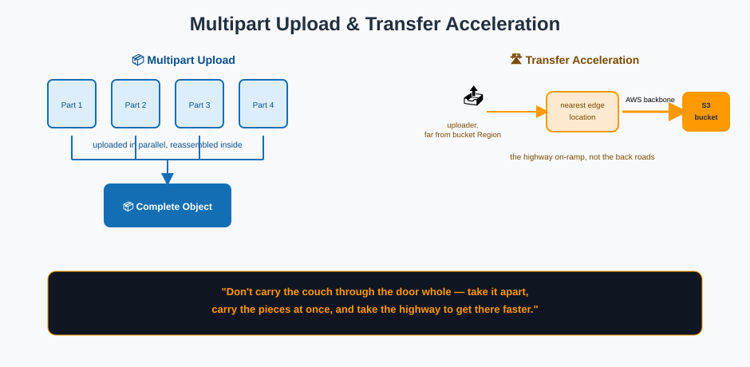

# Performance & Transfer — Moving Big Things Fast

## 📦 Multipart Upload: moving a couch through a doorway in pieces

A single PUT request tops out at **5 GB**, and AWS recommends switching to **multipart upload** for anything over about **100 MB**. Instead of forcing one giant object through the door in one piece, multipart upload breaks it into parts (each 5 MB – 5 GB, except the last), uploads them **independently and in parallel**, and reassembles them inside.

**Mnemonic:** *"Don't carry the couch through the door whole — take the legs off, carry each piece separately (even sending different pieces at once), and reassemble on the other side."*

Benefits beyond just handling objects over 5 GB:

- **Parallelism** — multiple parts upload simultaneously, dramatically improving throughput on fast connections
- **Resilience** — if one part fails, only that part needs to be retried, not the whole object
- **Pause and resume** — a multipart upload can be paused and continued later (within its lifecycle)

**Cost hygiene reminder:** an abandoned multipart upload leaves its already-uploaded parts sitting in the bucket, silently billed, forever — until you either complete it, abort it, or set a [lifecycle rule](lifecycle-management.md) to clean up incomplete multipart uploads automatically.

## 🛣️ Transfer Acceleration: the highway instead of back roads

**S3 Transfer Acceleration** routes an upload through the nearest **CloudFront edge location** first, then over Amazon's own optimized backbone network to the bucket's Region — instead of the public internet's unpredictable path the whole way.

**Mnemonic:** *"Drive to the nearest highway on-ramp (the edge location), then let Amazon's private highway carry you the rest of the way, instead of taking back roads for the entire trip."*

This helps most when:
- Uploading to a bucket from **far away geographically** (e.g., uploading from Australia to a bucket in `us-east-1`)
- The object is **large**, so the improved, more consistent throughput compounds

It uses a distinct endpoint: `<bucket>.s3-accelerate.amazonaws.com`, and AWS provides a speed-comparison tool to check whether it actually helps for a given source location before you pay its per-GB fee.

## 🔀 Request-rate scaling: many loading docks, not one

S3 automatically scales to handle very high request rates — thousands of requests per second per prefix — by **partitioning the keyspace behind the scenes**. Older guidance recommended randomizing key prefixes (e.g., a hash prefix) to avoid hot-spotting; modern S3 auto-scales partitions well enough that this is rarely necessary anymore, but **spreading heavy workloads across many distinct prefixes** still helps hit the highest throughput tiers.

**Mnemonic:** *"One loading dock can only unload trucks so fast. Spread the same volume of trucks across many docks (prefixes), and the whole warehouse moves boxes faster."*

## 📏 Byte-range fetches: ordering one page from a book, not the whole book

A GET request can specify a **byte range**, retrieving only part of an object — useful for resuming an interrupted download, or for reading just the header of a large file (e.g., checking a video's metadata) without pulling the entire object.

**Mnemonic:** *"You don't have to haul the whole box out to read one label inside it — ask for just the bytes you need."*

## Next up

Speed is one axis; **correctness** — knowing exactly when a change becomes visible — is another: see [Consistency Model](consistency-model.md).

[^aws-s3-multipart]: Amazon S3 User Guide, "Uploading and copying objects using multipart upload."
[^aws-s3-transfer-acceleration]: Amazon S3 User Guide, "Configuring fast, secure file transfers using Amazon S3 Transfer Acceleration."
[^aws-s3-performance]: Amazon S3 User Guide, "Best practices design patterns: optimizing Amazon S3 performance."
