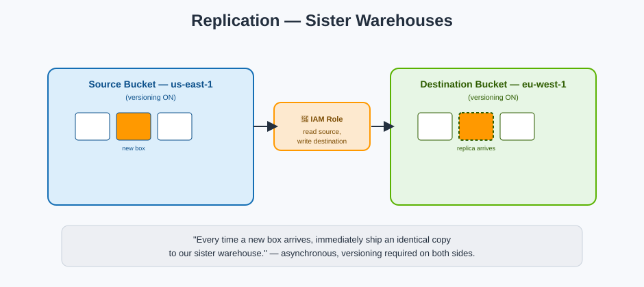

# Replication — Sister Warehouses

## 🚚 The mnemonic

**Replication** puts a standing order at the front desk: *"Every time a new box arrives, immediately ship an identical copy to our sister warehouse."* It's automatic, it's asynchronous (usually finishing in seconds, but not instant), and it only applies to boxes placed **after** the order was set up.

**Mnemonic:** *"Replication has no memory of the past — it only ships what arrives from today onward"* (existing objects need a one-time S3 Batch Replication job to backfill).

## The two flavors

| Type | Sister warehouse location | Typical use case |
|---|---|---|
| **CRR — Cross-Region Replication** | A different AWS Region | Disaster recovery, compliance requiring geographic redundancy, lower latency for users in another region |
| **SRR — Same-Region Replication** | The same AWS Region, different bucket | Aggregating logs into one bucket, keeping a copy in a different account for security separation, meeting data-residency rules that still allow same-region duplication |

## The requirements — memorize this checklist

Replication silently refuses to work if any of these are missing:

1. **Versioning must be enabled** on **both** the source and destination buckets.
2. An **IAM role** must exist that S3 can assume to read from the source and write to the destination.
3. The destination bucket can be in the **same or a different AWS account**.
4. A **replication rule** must specify which objects qualify (all objects, or filtered by prefix/tags).

**Mnemonic:** *"No versioning, no shipping — the sister warehouse needs a version history to receive into, just like the original."*

## What does and doesn't replicate by default

| Replicates by default | Needs to be explicitly enabled |
|---|---|
| New object PUTs after the rule is created | Objects that existed **before** the rule (needs S3 Batch Replication) |
| Object tags and ACLs (if configured) | Objects encrypted with SSE-KMS (needs an explicit opt-in due to cross-key considerations) |
| | Delete markers propagating to the destination (opt-in) |
| | Replicating a replica again — "replica of a replica" chaining (opt-in, since 2019) |

## Why you'd choose CRR specifically

- **Disaster recovery**: if an entire AWS Region became unavailable, your data still exists, live, in another Region.
- **Latency**: serve users on another continent from a nearby copy instead of the original Region.
- **Compliance**: some regulations require a geographically separate backup copy.

## Next up

Replication decides *where else* a copy lives. Just as important is deciding *who's allowed near the original box at all* — see [Security & Access Control](security-and-access-control.md).

[^aws-s3-replication]: Amazon S3 User Guide, "Replicating objects."
