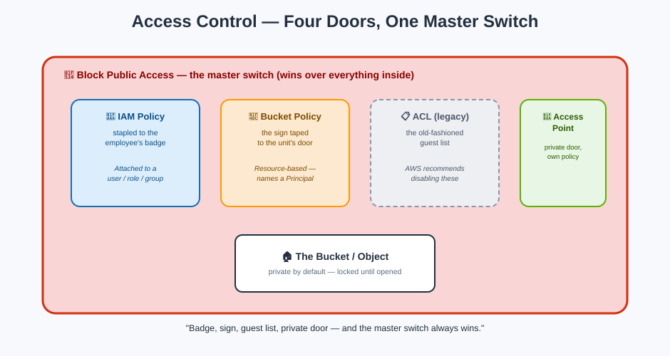

# Security & Access Control — Guarding the Units



## The starting rule: every unit is locked by default

A brand-new bucket, and every object inside it, is **completely private** — accessible only to the account that created it. Nothing in S3 is public unless someone deliberately makes it so, through one of four mechanisms.

This is the exact same "silence means no" idea from [IAM's policy evaluation logic](../iam/policy-evaluation-logic.md) — S3's access control is IAM's evaluation model, applied to storage units instead of a whole building.

## The four ways in

| Mechanism | Attached to | Analogy |
|---|---|---|
| **IAM policy** | A user, group, or role | The rule stapled to an employee's badge, saying which units they can enter |
| **Bucket policy** | The bucket itself | The sign taped to a specific unit's door, naming who may enter and how |
| **ACL (Access Control List)** | The bucket or an individual object | An old-style, coarse-grained guest list — AWS recommends disabling these in favor of policies |
| **Block Public Access** | The bucket or the whole account | A master switch that welds every door shut to the public, no matter what any sign or badge says |

**Mnemonic:** *"Badge, sign, guest list, master switch — and the master switch always wins."*

## Bucket policies — a resource-based policy, exactly like IAM's

A bucket policy is a [resource-based policy](../iam/policies.md), written in the same JSON structure as everything else in IAM — with one difference: because the policy lives on the resource, not on an identity, it **must** name a `Principal`.

```json
{
  "Version": "2012-10-17",
  "Statement": [{
    "Sid": "AllowReadFromPartnerAccount",
    "Effect": "Allow",
    "Principal": { "AWS": "arn:aws:iam::999999999999:root" },
    "Action": "s3:GetObject",
    "Resource": "arn:aws:s3:::reports-bucket/*"
  }]
}
```

For a **same-account** request, either the IAM policy *or* the bucket policy saying Allow is generally enough. For **cross-account** access, both sides typically need to agree — the requester's IAM policy must allow the call, *and* the bucket policy must explicitly trust that other account. This mirrors [IAM's cross-account rule](../iam/policy-evaluation-logic.md) precisely.

## Block Public Access — the master switch

**Block Public Access (BPA)** is the single control most responsible for preventing accidental data leaks. It has four independent settings, at both the **account level** and the **bucket level**:

1. Block public ACLs from being set
2. Ignore any public ACLs that already exist
3. Block public bucket policies from being set
4. Ignore any public bucket policy that already exists

**Mnemonic:** *"BPA doesn't ask the sign or the guest list what they say — it just refuses to open the door to the public, period."* Since 2023, **new buckets have all four BPA settings enabled by default** — you have to deliberately turn them off to allow any public access at all.

## ACLs — the legacy guest list

ACLs predate IAM policies and bucket policies. They grant permissions to a very limited set of grantees (specific AWS accounts, or predefined groups like "All Users") with very coarse actions (READ, WRITE, FULL_CONTROL). AWS's current guidance: **disable ACLs** (the "Bucket owner enforced" object ownership setting does this) and use policies for everything — ACLs remain mainly for legacy compatibility.

## Cross-account access, step by step

1. The **bucket owner's** bucket policy grants access to the other account (or a specific role/user in it).
2. The **other account's** IAM policy grants its own user/role permission to make the call.
3. Both must agree — this is the "both gates must be open" rule from [policy evaluation logic](../iam/policy-evaluation-logic.md).

## Next up

For finer-grained, per-team access into the same bucket without juggling one giant bucket policy, see [Access Points](access-points.md).

[^aws-s3-access-control]: Amazon S3 User Guide, "Identity and access management in Amazon S3."
[^aws-s3-block-public-access]: Amazon S3 User Guide, "Blocking public access to your Amazon S3 storage."
