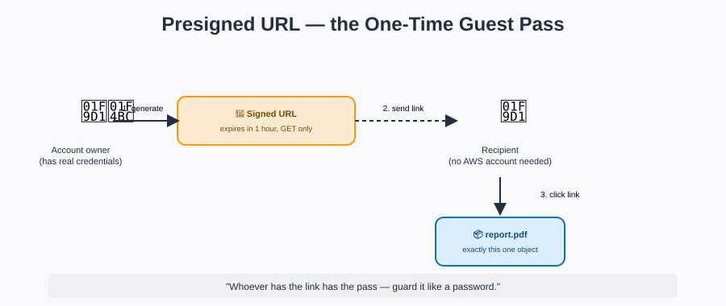

# Sharing & Presigned URLs — the One-Time Guest Pass



## 🎫 The mnemonic

Making a whole bucket public just so one person can grab one file is like **rekeying the entire warehouse** because a courier needs to pick up a single package. A **presigned URL** is the courier's pass instead: a plain HTTPS link, valid for a limited time, that grants exactly one operation (usually GET, sometimes PUT) on exactly one object — without the requester ever needing AWS credentials, an IAM identity, or any relationship to your account at all.

**Mnemonic:** *"Same idea as an IAM role's temporary credentials — but scaled down to one box, one action, one expiry."* (See [Roles](../iam/roles.md) and [Federation & STS](../iam/federation-and-sts.md) for the identity-side version of the same pattern.)

## How it works, mechanically

The person generating the URL (who **does** have valid AWS credentials and permission to perform the action) signs a request using their credentials and an expiration time. The resulting URL embeds that signature. Anyone holding the URL can use it — **the URL itself is the credential** until it expires.

```
https://my-bucket.s3.amazonaws.com/report.pdf
  ?X-Amz-Algorithm=AWS4-HMAC-SHA256
  &X-Amz-Credential=...
  &X-Amz-Date=20260913T000000Z
  &X-Amz-Expires=3600
  &X-Amz-Signature=...
```

**Mnemonic:** *"Whoever has the link has the pass — guard the link like you'd guard a password, because functionally, it is one."*

## Key facts to lock in

- Expiration is capped at **7 days** when signed using an IAM role's temporary credentials (since the URL can't outlive the credentials that signed it); using an IAM user's long-term access keys allows longer expirations, up to 7 days by default in most SDKs but configurable.
- The permission check happens **at generation time AND at use time** — if the signer's own permissions are revoked before the URL expires, the URL stops working immediately, even if its expiration timestamp hasn't passed.
- A presigned URL works for **both GET (download) and PUT (upload)** — you can hand someone a pass that lets them drop a box into your unit without ever becoming a tenant.
- Presigned URLs don't bypass [Block Public Access](security-and-access-control.md) settings that are explicitly scoped to block them, and they don't bypass an explicit **Deny** anywhere in the evaluation chain — the "DAN always wins" rule from [IAM's evaluation logic](../iam/policy-evaluation-logic.md) still applies.

## Requester Pays — flipping who picks up the bill

By default, the **bucket owner** pays for all storage and data transfer costs, including when someone downloads via a presigned URL. Enabling **Requester Pays** flips data transfer and request costs onto whoever is doing the downloading — useful for buckets that provide public datasets to many outside consumers, where the owner doesn't want to fund everyone else's bandwidth.

**Mnemonic:** *"Normally the warehouse owner pays for every box that leaves. Requester Pays makes the courier's own company foot that bill instead."*

## Next up

Sometimes you don't want to hand out individual passes at all — you want the whole unit to act like a public storefront: [Static Website Hosting](static-website-hosting.md).

[^aws-s3-presigned-urls]: Amazon S3 User Guide, "Sharing an object with a presigned URL."
