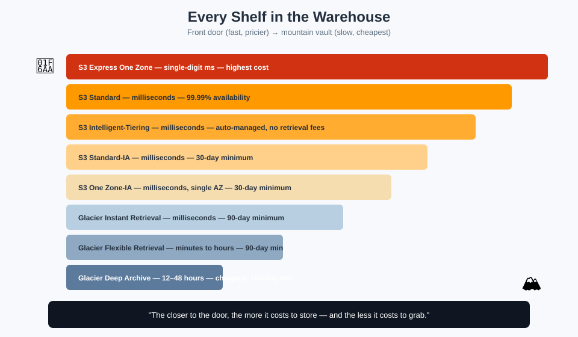

# Storage Classes — Every Shelf in the Warehouse

## 🗄️ The mnemonic

Every box you own can sit on a different **shelf**, and the shelf you pick trades **price** against **how fast you can get the box back**. The front shelf by the door is expensive real estate but instant access. The sealed vault buried in the mountain is nearly free but takes half a day to retrieve from.



**Mnemonic sentence:** *"The closer to the door, the more it costs to store — and the less it costs to grab."*

## The full shelf-by-shelf comparison

| Shelf (Storage Class) | Retrieval speed | Availability | Min. storage duration | Best for |
|---|---|---|---|---|
| **S3 Express One Zone** | Single-digit ms, fastest tier | 99.95% (1 AZ) | None | Latency-critical, high-throughput workloads (ML training, interactive analytics) |
| **S3 Standard** | Milliseconds | 99.99% (≥3 AZs) | None | Frequently accessed, general-purpose data |
| **S3 Intelligent-Tiering** | Milliseconds (auto-tiered) | 99.9% | None (base tiers) | Unknown or changing access patterns — a robot moves it for you |
| **S3 Standard-IA** | Milliseconds | 99.9% (≥3 AZs) | 30 days | Infrequently accessed, but needed fast when it is |
| **S3 One Zone-IA** | Milliseconds | 99.5% (1 AZ) | 30 days | Infrequent, re-creatable, or secondary-copy data |
| **S3 Glacier Instant Retrieval** | Milliseconds | 99.9% | 90 days | Archive data accessed roughly once a quarter |
| **S3 Glacier Flexible Retrieval** | Minutes to hours | 99.99% | 90 days | Archives accessed a few times a year |
| **S3 Glacier Deep Archive** | Hours (12–48h) | 99.99% | 180 days | Long-term retention (7–10 years), rarely if ever restored |

**Mnemonic for the min. storage duration numbers:** *30, 30, 90, 90, 180 — the deeper the vault, the longer the lease.* (Standard-IA: 30, One Zone-IA: 30, Glacier Instant: 90, Glacier Flexible: 90, Deep Archive: 180.) Delete or transition an object before its minimum duration is up, and you're billed for the remaining time anyway.

## Glacier retrieval tiers, in detail

"Glacier" isn't one speed — each Glacier class offers multiple retrieval options, trading cost against wait time:

| Class | Retrieval option | Time |
|---|---|---|
| Glacier Flexible Retrieval | Expedited | 1–5 minutes |
| Glacier Flexible Retrieval | Standard | 3–5 hours |
| Glacier Flexible Retrieval | Bulk | 5–12 hours |
| Glacier Deep Archive | Standard | Within 12 hours |
| Glacier Deep Archive | Bulk | Within 48 hours |

**Mnemonic:** *"Expedited if you're panicking, Standard if you can wait for coffee, Bulk if you can wait for the weekend."*

## S3 Intelligent-Tiering — the shelf that manages itself

Intelligent-Tiering automatically moves objects between **five internal access tiers** based on actual usage, with **no retrieval fees ever**:

1. Frequent Access (like Standard)
2. Infrequent Access (like Standard-IA) — after 30 days with no access
3. Archive Instant Access — after 90 days with no access
4. Archive Access (optional, like Glacier Flexible) — after 90–730 days, configurable
5. Deep Archive Access (optional, like Glacier Deep Archive) — after 180–730 days, configurable

**Mnemonic:** *"A robot on the floor watches which boxes you visit, and quietly wheels the dusty ones to the back — for a small monitoring fee per object."* This makes it the right default when you genuinely don't know an object's access pattern in advance.

## How to actually choose

```
Do you access it constantly?              → S3 Standard
Don't know / it varies?                    → S3 Intelligent-Tiering
Infrequent, but need it back instantly?    → S3 Standard-IA (or One Zone-IA if it's replaceable)
Archived, but occasionally need it now?    → S3 Glacier Instant Retrieval
Archived, can wait hours?                  → S3 Glacier Flexible Retrieval
Archived for years, almost never touched?  → S3 Glacier Deep Archive
Need blazing, sub-10ms, high-throughput?   → S3 Express One Zone
```

## Next up

Storage classes decide *where* a box sits today. [Lifecycle Management](lifecycle-management.md) decides how it *moves between shelves automatically over time* — but first, learn how to keep every past edition of a box: [Versioning](versioning.md).

[^aws-s3-storage-classes]: Amazon S3 Storage Classes, aws.amazon.com/s3/storage-classes.
[^aws-s3-storage-classes-guide]: Amazon S3 User Guide, "Using Amazon S3 storage classes."
