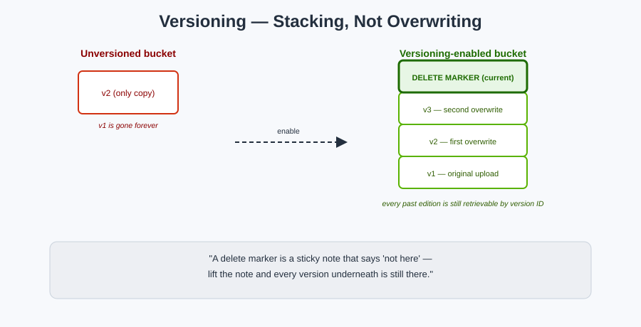

# Versioning — Never Truly Overwriting a Box

## 🕰️ The mnemonic

By default, if you drop a new box on top of an old one with the same label, the old box is **gone**. Turn on **Versioning**, and instead the warehouse keeps a **stack** — every edition ever placed under that label, each with its own version ID, going back to the very first one.

**Mnemonic:** *"Versioning turns 'overwrite' into 'stack a new one on top' — nothing at the bottom of the stack ever disappears on its own."*

## The three states a bucket can be in

| State | Meaning |
|---|---|
| **Unversioned** (default) | New PUTs overwrite in place; DELETEs are permanent and irreversible |
| **Versioning-enabled** | Every PUT creates a new version; every DELETE just adds a *delete marker* on top of the stack |
| **Versioning-suspended** | New objects get version ID `null`; existing versions are preserved but no new ones are created |

**Key one-way rule:** once you enable versioning, you can **suspend** it later, but you can **never fully turn it back to "unversioned"** — the bucket remembers it was versioned.

## Delete markers — the "soft delete"

With versioning on, a DELETE request doesn't erase anything. It places an invisible **delete marker** on top of the version stack. The object now appears "deleted" (a plain GET returns 404), but every previous version is still sitting underneath, retrievable by version ID.

**Mnemonic:** *"A delete marker is a sticky note that says 'not here' — lift the note (delete the marker itself) and every version underneath is still there."*

To permanently delete a specific edition, you must issue a DELETE **naming its exact version ID** — that's the only kind of delete that's truly irreversible.

## MFA Delete — a lock on the delete button itself

For buckets holding critical data, **MFA Delete** requires a valid MFA code for two of the most dangerous actions:

1. Permanently deleting an object version
2. Changing the bucket's versioning state

**Mnemonic:** *Same "know + have" idea as [IAM's MFA](../iam/mfa.md) — a stolen password alone can't wipe your version history.*

## Versioning pairs directly with three other concepts

- **[Lifecycle Management](lifecycle-management.md)** — you can set rules to transition or expire *non-current* (older) versions automatically, so your version stack doesn't grow forever.
- **[Replication](replication.md)** — **requires** versioning to be enabled on both source and destination buckets.
- **[Object Lock](object-lock-and-compliance.md)** — also requires versioning; each locked version is individually protected.

## Cost trap to remember

Versioning doesn't cost anything to turn on — but **every version is a fully billed, separate object**. A bucket that's overwritten a 1 GB file weekly for a year without lifecycle rules is quietly storing 52 GB, not 1 GB. Always pair versioning with a lifecycle rule that expires old versions after a reasonable window.

## Next up

Now automate what happens to every box, old versions included, over time: [Lifecycle Management](lifecycle-management.md).

[^aws-s3-versioning]: Amazon S3 User Guide, "Using versioning in S3 buckets."
