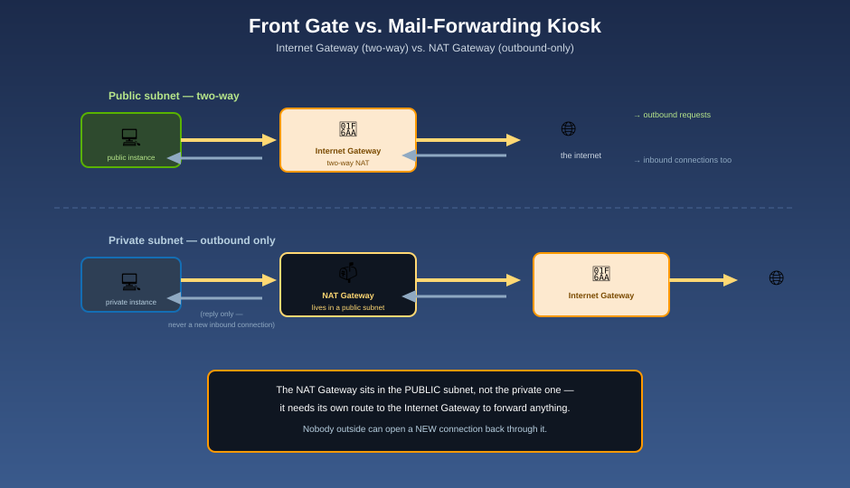

# NAT Gateways — The Mail-Forwarding Kiosk

## 📫 The mnemonic

Residents on a private street can't just walk out the front gate — that gate is for public streets only, and their street has no direct route to it. But they still need to send mail out: software updates, calls to a third-party API, a package pulled down from the internet. So the community builds a **mail-forwarding kiosk** just inside the front gate. Residents drop outbound mail there, it gets forwarded under the kiosk's own return address, and any reply comes straight back to the resident who sent it — but a stranger on the outside can't address mail *to* a resident through that kiosk. That's a **NAT Gateway**: outbound-initiated internet access for private subnets, with no path for the internet to initiate a connection back in.

## Why private subnets need this at all

Instances in a private subnet (see [Subnets](subnets.md)) have no route to an [Internet Gateway](internet-gateway.md) — by design, nothing on the public internet can reach them directly. But "unreachable from outside" and "can't reach outside" are two different properties, and most private workloads still need the second one: pulling OS patches, calling a payment processor's API, reporting metrics to a SaaS vendor. A NAT Gateway supplies exactly that: outbound access, with the inbound door still welded shut.

## How it actually works

1. You create the NAT Gateway **inside a public subnet** — this is the detail that trips people up most: the kiosk has to be near the front gate to reach it, so it can't live on a private street itself.
2. You attach an **Elastic IP** (a static public IPv4 address) to the NAT Gateway — this becomes the one return address every piece of forwarded mail carries.
3. In each **private** subnet's route table, you add a route for `0.0.0.0/0` targeting the NAT Gateway (instead of the Internet Gateway).
4. When an instance in that private subnet makes an outbound request, the NAT Gateway translates its private source address to the Elastic IP, sends it out through the public subnet's route to the Internet Gateway, and tracks the connection so the **response** routes straight back to the instance that asked for it.
5. Nobody on the outside can *initiate* a new connection back in through that same path — there's no listener, and no route for it.



**Mnemonic:** *"The kiosk has to stand on the public street to reach the gate — that's why a NAT Gateway lives in a public subnet, even though it only serves private ones."*

## One NAT Gateway per Availability Zone — the standard HA pattern

A NAT Gateway is itself scoped to a single Availability Zone. The recommended pattern is:

```
AZ us-east-1a: Public subnet → NAT Gateway A ← Private subnet (routes to NAT Gateway A)
AZ us-east-1b: Public subnet → NAT Gateway B ← Private subnet (routes to NAT Gateway B)
AZ us-east-1c: Public subnet → NAT Gateway C ← Private subnet (routes to NAT Gateway C)
```

Each AZ gets its **own** NAT Gateway, and each AZ's private subnet routes only through the NAT Gateway in its **own** AZ — never across to another AZ's.

**Mnemonic:** *"Give every borough its own kiosk. Routing a borough's mail through a kiosk in a different borough adds a toll (cross-AZ data transfer charges) and a single point of failure you didn't need."* If you instead shared one NAT Gateway across every AZ's private subnets, that one AZ's NAT Gateway failing would take down outbound access for private subnets in AZs that were otherwise perfectly healthy — you'd have quietly rebuilt a single point of failure inside a "Multi-AZ" design (see [Designing for High Availability](../global-infrastructure/designing-for-high-availability.md)).

## NAT Gateway vs. NAT Instance

Before the managed NAT Gateway existed, the only option was a self-managed **NAT instance** — an ordinary EC2 instance configured to forward traffic. AWS still supports this pattern, but it's rarely the right default choice today:

| | NAT Gateway (managed) | NAT Instance (self-managed EC2) |
|---|---|---|
| Availability | Highly available within its AZ, managed by AWS | A single EC2 instance — a single point of failure unless you build your own failover |
| Bandwidth | Scales automatically, up to very high throughput | Capped by the instance type you chose |
| Maintenance | None — AWS patches and operates it | You patch the AMI and manage it yourself |
| Security groups | **Cannot** have a security group attached | Can — and can double as a bastion host or do port forwarding |
| Cost model | Hourly charge + per-GB data processing charge | EC2 instance cost — can be cheaper for very low, steady traffic, at the price of your own operational effort |

**Mnemonic:** *"A NAT Gateway is a kiosk the city built, staffed, and maintains for you. A NAT instance is a folding table you set up yourself — cheaper for a quiet street, but you're the one who has to show up and keep it running."*

## The cost trap: you pay per gigabyte, in both directions

A NAT Gateway bills two ways: an **hourly charge** for the gateway simply existing, and a **per-GB data processing charge** for every gigabyte that flows through it — inbound and outbound. For workloads that move a lot of data (large downloads, big backups, high-volume logging to a third party), this per-GB charge can dwarf the hourly cost and become the single biggest line item in a network bill.

**The most common fix:** if the "outbound" traffic is actually bound for **Amazon S3 or DynamoDB**, it never needed to leave AWS's own network in the first place. Route it through a **Gateway VPC Endpoint** instead (see [VPC Peering & Endpoints](vpc-peering-and-endpoints.md)) — that traffic bypasses the NAT Gateway entirely, at no per-GB charge, and stops consuming NAT bandwidth altogether.

**Mnemonic:** *"Don't pay the mail-forwarding kiosk to hand-carry a package to a building that's already inside the same gated community."*

## Public NAT Gateway vs. private NAT Gateway

Most NAT Gateways are **public**: they hold an Elastic IP and route traffic out to the internet via an Internet Gateway, exactly as described above. AWS also offers a **private NAT Gateway** variant: no public IP at all, used purely to route traffic **between VPCs or to an on-premises network** (typically alongside a [Transit Gateway](connecting-to-on-premises.md)) without ever touching the public internet — useful when instances in overlapping architectures need outbound-style address translation internally, but should never be capable of reaching the public internet at all.

## A quick note on IPv6

NAT Gateways translate **IPv4** traffic only. For an instance that needs outbound-only **IPv6** internet access, the equivalent tool is an **Egress-Only Internet Gateway** — conceptually the same one-way-out idea, but built for IPv6, which doesn't use address translation the way IPv4 does.

## Next up

A NAT Gateway controls *whether* traffic can leave — it says nothing about who's allowed to talk to whom once they're on the same street. That's the next layer: [Security Groups & Network ACLs](security-groups-and-nacls.md).

[^aws-vpc-nat-gateway]: Amazon VPC User Guide, "NAT gateways."
[^aws-vpc-nat-comparison]: Amazon VPC User Guide, "Compare NAT gateways and NAT instances."
