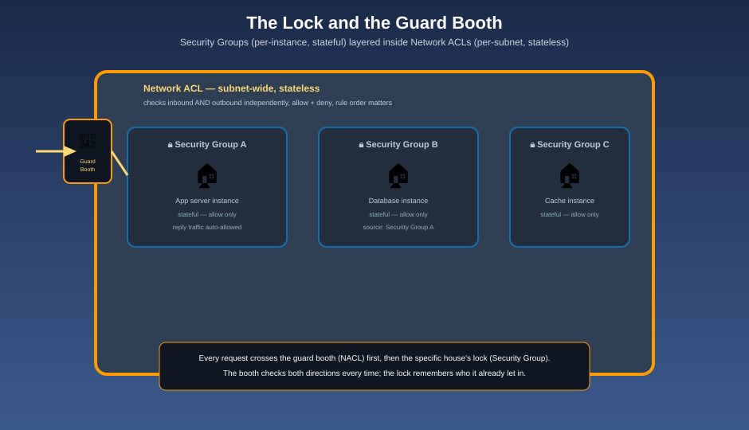

# Security Groups & Network ACLs — The Lock and the Guard Booth

## 🔒🚧 The mnemonic

Two separate layers of security protect the gated community, at two different scopes:

- A **Security Group** is the **lock on one house's front door** — it protects a single instance (or ENI), it's **stateful** (if you let a visitor in, their reply mail is automatically allowed back out, no extra rule needed), and it can only say **"allow"** — there's no way to explicitly lock someone out with a Security Group.
- A **Network ACL (NACL)** is the **guard booth at the entrance to an entire street** — it protects every house on that subnet at once, it's **stateless** (inbound and outbound traffic are each checked independently — nothing is "remembered" between directions), and it can say both **"allow"** and **"deny."**

## Side by side

| | Security Group | Network ACL |
|---|---|---|
| Scope | Instance / ENI level | Subnet level — applies to every resource in the subnet |
| State | **Stateful** — return traffic is automatically allowed | **Stateless** — inbound and outbound rules are evaluated independently |
| Rule types | **Allow only** — default deny for anything not explicitly allowed | **Allow and deny** — you can explicitly block a source |
| Evaluation | All rules across every attached Security Group are combined — since only "allow" exists, there's nothing to conflict | Rules evaluated **in order by rule number**, lowest first; the first match wins |
| Default behavior | A new Security Group denies all inbound, allows all outbound | The **default** NACL allows all traffic both ways; a **custom** NACL denies everything until you add rules |
| Can reference other groups? | Yes — a rule's source/destination can be another Security Group | No — only CIDR ranges |

**Mnemonic:** *"The lock only knows how to say yes. The guard booth can say yes or no — and it says it twice, once on the way in, once on the way out, because it never remembers your last answer."*

## Why "stateful vs. stateless" is the detail that bites people

Because a Security Group is stateful, allowing inbound traffic on port 443 automatically permits the corresponding response traffic out — you never write a matching outbound rule for a reply. A NACL has no such memory: if you allow inbound traffic on port 443, you must **also** add an outbound rule allowing the response (typically on the ephemeral port range the client used), or the reply gets silently dropped at the guard booth even though the request got in fine.

**Mnemonic:** *"The lock remembers who it let in. The guard booth has no memory at all — check both directions, every time, at the street level."*

## Why rule order matters for NACLs, and not for Security Groups

A NACL evaluates its rules **in numeric order**, and the **first rule that matches wins** — a `DENY` at rule #100 stops a request cold even if rule #200 would have allowed it. A Security Group has no such ordering problem, precisely because it only ever allows: there's nothing for two rules to disagree about, so the whole set is just combined together.

**Mnemonic:** *"The guard booth reads its instructions in order and stops at the first match. The lock just checks its whole list of approved names — order never matters when every entry means 'yes.'"*

## Using both together, on purpose

These two layers aren't redundant — they're **defense in depth**:

- Security Groups do the fine-grained, per-instance work: "only my load balancer's Security Group may talk to my application instances on port 8080."
- NACLs do the coarse, subnet-wide backstop: "explicitly deny this one known-bad CIDR range for the entire private subnet, regardless of what any instance's Security Group says."

**Mnemonic:** *"The lock decides who's invited into which house. The guard booth is the blunt instrument for 'this address is never welcome on this street, full stop.'"*

## Next up

Both of these control traffic *within* your own community's walls. For traffic between two entirely separate communities — or straight to an AWS service's own building — see [VPC Peering & Endpoints](vpc-peering-and-endpoints.md).

[^aws-vpc-sg-nacl]: Amazon VPC User Guide, "Security groups vs. network ACLs."
